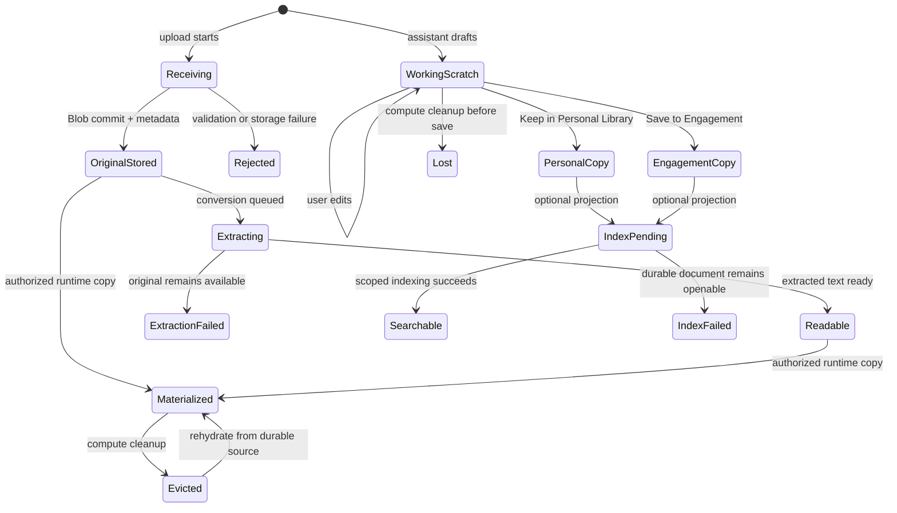

# Documents and Retrieval

> **Authority:** Canonical subordinate design for uploads, drafts, artifacts, document reads,
> retrieval, and citations  
> **State:** Reference direction; not part of the MVP release bar except where an existing Engagement artifact surface is retained
>
> **Parent:** [Authoritative Product and System Design](../design.md)  
> **Applies to:** Private conversation files, Personal Library documents, Engagement artifacts,
> conversion, optional Search, artifact-canvas behavior, and document-grounded assistant answers  
> **Last reviewed:** 2026-07-14  
> **Issue:** [#18](https://github.com/DanGiannone1/csa-workbench/issues/18)

## The short version

The MVP does not require Personal Library, draft promotion, document conversion, semantic Search,
or retrieval. Those patterns remain here as reference material rather than implied release scope.
If the existing Engagement artifact surface remains in the MVP, it must still enforce current
membership and role rules and must never expose private bytes by inference.

The remainder of this document describes the optional direction for a later document capability.

Think of CSA Workbench as having a desk, a bookshelf, and a filing cabinet:

- **The desk is a private conversation.** Files uploaded there are private to the signed-in user and
  durable enough to resume the conversation. Assistant-generated drafts and intermediate working
  files are scratch until the user explicitly keeps them.
- **The bookshelf is the Personal Library.** It is a private, durable place for documents the user
  wants to keep and open across conversations. It remains useful when semantic Search is off.
- **The filing cabinet is the Engagement.** Its artifacts are durable and shared with current
  Engagement members. Only an owner or editor can put a private file or draft there. Viewers are
  read-only.

A conversation may be tagged to an Engagement, but the desk does not thereby become shared. A chat
upload or draft reaches the filing cabinet only through an explicit **Save to Engagement** action.
That visibility change is never inferred from the current screen, model prose, or a filename.

The baseline product can upload, convert, list, open, and directly read authorized documents without
Azure AI Search. Search is an optional derived projection and stays off until actor realm and scope
filtering, managed identity, private data access, and multi-user isolation are behaviorally proven.

## Product vocabulary and boundaries

CSA Workbench uses four product concepts:

| Concept | Meaning | Durable? | Visibility |
|---|---|---:|---|
| Conversation upload | A source file attached to one private conversation | Yes | Conversation owner |
| Working draft | An assistant-generated or user-edited file in runtime scratch | No, until saved | Conversation owner while available |
| Personal Library document | A file the user explicitly keeps for private reuse | Yes | That actor only |
| Engagement artifact | A file explicitly published to an Engagement | Yes | Current Engagement members |

An **extracted representation** is conversion output used to preview or read an original document. It
is derived data, not a separate user-owned document. A **search index entry** is likewise a
rebuildable projection, never the only copy and never the authority for access.

The parent design owns the high-level two-scope model and compute boundary. Detailed conversation
rehydration belongs to [Session and state](session-state.md); role and realm rules belong to
[Identity and access](identity-access.md); tool outcomes belong to [CRUD](crud.md) and
[Agent harness](agent-harness.md); artifact-canvas presentation belongs to [UI/UX](ui-ux.md);
trusted turn scope belongs to [Context](context.md); optional Search deployment belongs to
[Infrastructure](infrastructure.md); and proof belongs to [Testing and evals](testing-evals.md).

## Priority user journeys

### Upload a source and continue later

1. A signed-in user uploads a supported file to a private conversation.
2. CSA Workbench durably stores the original bytes and metadata before reporting that the upload was kept.
3. CSA Workbench shows the source immediately with a separate conversion state such as **Processing for
   reading**.
4. The user or assistant may directly read the extracted representation when it becomes ready.
5. After compute scales in or restarts, CSA Workbench reloads the conversation and upload metadata, then
   materializes the authorized file into runtime scratch only when needed.

Conversion failure does not erase a successfully stored original. The UI says that the original is
available but the assistant cannot read it yet.

### Draft a deliverable privately

1. The user asks the assistant to draft a brief, plan, diagram description, or other text
   deliverable.
2. The assistant writes a working file in private runtime scratch.
3. The artifact canvas labels it **Private working draft · AI-generated · unreviewed · not saved**.
4. The user can review and edit supported text formats while the scratch file exists.
5. The user explicitly chooses **Keep in Personal Library** or **Save to Engagement** if the result
   should survive.

Until one of those actions commits, neither the assistant nor the UI calls the draft durable. If
runtime scratch is lost, CSA Workbench shows that the working file is unavailable rather than retaining a
canvas card that implies the bytes still exist.

### Save private work to an Engagement

1. An owner or editor chooses **Save to Engagement** on a conversation upload, Personal Library
   document, or working draft.
2. CSA Workbench requires an explicit target Engagement when the target is not already unambiguous and
   authorized.
3. The confirmation surface states that the new artifact will be visible to current members.
4. The backend rechecks the actor's live membership and role, copies the bytes into the Engagement
   artifact namespace, writes metadata and activity, and returns a structured committed result.
5. The UI refetches the Engagement and shows the new artifact only from committed state.

The private source remains private. Promotion is a copy with provenance, not a scope mutation. A
failed or unknown commit never becomes a narrated success.

### Open or ground an answer in a known document

The user can list and open authorized documents without Search. The assistant can likewise use a
permissioned direct-read tool when the user names a conversation upload, Personal Library document,
or Engagement artifact, or when deterministic scope resolution yields one unique authorized source.
The returned text identifies the durable source and extraction state; it is not read from a search
index reconstruction.

### Search an authorized corpus when the optional capability is enabled

The user asks a question in an explicit personal or Engagement scope. The backend binds the actor,
realm, and allowed namespace outside model-visible arguments, applies mandatory filters before any
passage leaves Search, and returns structured passages with stable source locators. No result,
unavailable Search, processing sources, and denied access remain distinct outcomes.

Cross-Engagement retrieval is not a default v1 behavior. Comparing a private document with an
Engagement artifact requires both sources or scopes to be resolved explicitly; it does not share the
private document.

## Lifecycle and explicit promotion



The important transitions are:

- `OriginalStored` means the resumable source is durable; it does not promise conversion succeeded.
- `WorkingScratch` is deliberately ephemeral. Conversation text may survive while a generated file
  does not.
- `PersonalCopy` and `EngagementCopy` are new durable records with their own bytes, attribution, and
  source provenance.
- `Searchable` is optional. A durable document remains listable, openable, and directly readable if
  indexing is disabled or fails.

V1 does not introduce an elaborate revision system. Saving changed content to an Engagement creates
a new artifact with `derivedFromArtifactId` or source provenance where applicable. The earlier
artifact remains a separate record until an authorized user removes it. CSA Workbench does not silently
overwrite cited shared bytes.

## Systems of record and minimum metadata

### Storage ownership

| Data | System of record | Notes |
|---|---|---|
| Conversation and upload metadata | Cosmos conversation aggregate | Private actor scope, optional Engagement tag does not change visibility |
| Conversation upload original | Blob | Durable, actor/conversation namespace, no public URL |
| Working draft and runtime materialization | Session workspace | Cache/scratch only; safe to lose |
| Personal Library metadata | Cosmos personal scope | Private to the actor |
| Personal Library bytes | Blob | Durable actor namespace |
| Engagement artifact metadata | Cosmos Engagement aggregate | Membership-gated, activity-attributed |
| Engagement artifact bytes | Blob | Durable Engagement namespace |
| Extracted text and locator map | Blob or equivalent durable derived object | Bound to source content hash; rebuildable |
| Search chunks | Optional Search index | Derived, scope-filtered, rebuildable, never authoritative |

Cosmos owns metadata and authorization-bearing relationships; Blob owns durable bytes; compute owns
only materialized copies and scratch. Blob object names are implementation identifiers, not
authorization. Every byte read enters through an application service that rechecks the owning scope.

### Logical metadata

The scopes may store metadata in their existing aggregates, but they use one small logical shape so
the UI and application service do not guess from filenames:

```text
documentId
filename, displayName, contentType, size, sha256
scopeKind: conversation | personal | engagement
scopeId
kind: upload | library | artifact
createdBy, createdAt
contentState: stored | missing | removed
extractionState: not_needed | pending | ready | failed | unsupported
extractedObjectKey?
locatorMapKey?
indexState: disabled | pending | ready | failed | removed
sourceDocumentId?, sourceSha256?, generatedByRunId?, derivedFromArtifactId?
```

`documentId`, not filename, is the durable identity. Two users and two Engagements may all have a
`brief.md` without collision. Content hash supports integrity and citation stability without
requiring a full revision subsystem.

Storage transitions use a bounded idempotency key. Promotion writes bytes before publishing visible
metadata, compensates orphan bytes if metadata fails, and records an explicit degraded/reconciliation
state when an outcome cannot be established. Indexing happens only after the durable record commits.

## Authorization contracts

### Conversation and Personal Library

- A conversation is private to its actor in v1, even when tagged with an Engagement ID.
- Only that actor can list, open, directly read, convert, keep, or remove its uploads and Personal
  Library documents.
- An Engagement member cannot discover another member's conversation, filenames, snippets, or
  derived representations.
- Realm is part of identity. Synthetic demo actors can access only synthetic documents; a matching
  username or filename in another realm grants nothing.

### Engagement artifacts

- Current members may list, open, download, and directly read artifacts.
- Viewers are read-only and see no upload, Save to Engagement, replace, or remove affordance.
- Owners and editors may upload or promote an artifact and may remove one.
- Non-members receive the same not-found result as an unknown Engagement or artifact.
- Membership and role are rechecked at operation time and within every optimistic-concurrency retry.
- Removing or demoting a member takes effect on the next read, direct-read, Search, and citation-open
  request; a prior context snapshot or Search result grants no continuing access.

The browser and model may supply document or Engagement IDs as intent, but never actor identity,
realm, role, Blob object keys, or trusted retrieval filters.

## Authorized direct-read contract

Direct read is the baseline grounding mechanism and does not depend on Search. It operates on one
resolved durable document at a time.

### Request

Trusted transport binds:

```text
actorId, actorRealm, ownedConversationId?, contextId
requestedDocumentId
optional expectedScopeKind and expectedScopeId
```

The application service:

1. resolves the document by stable ID;
2. reauthorizes its live scope;
3. selects the authoritative extracted representation for the current content hash, or accepts a
   natively readable text source;
4. enforces size and content limits; and
5. returns a structured outcome.

### Result

```text
status: ready | processing | unsupported | failed | not_found | forbidden
documentId, displayName, scopeKind, scopeId
sourceSha256
content?                     # only when ready and within bounds
locatorMap?                  # headings/pages/paragraphs available to citations
degradedReason?
```

`processing`, `unsupported`, and `failed` never return invented or partially decoded content as
ready. A binary original may remain downloadable even when direct read is unsupported. Large files
use bounded sections or a deterministic user-selected range rather than silently truncating facts.

## Optional retrieval and citation contract

### Enablement gate

Semantic Search is off in the baseline. It may be enabled only when evidence proves all of the
following in the deployed profile:

- index documents carry `actorRealm`, `scopeKind`, `scopeId`, `documentId`, and `sourceSha256`;
- every query applies server-constructed realm and scope filters before results are returned;
- identical filenames and document IDs from different actors/scopes cannot overwrite or retrieve
  one another;
- live authorization is checked before query and again when a citation is opened;
- Search uses managed identity over the approved private access path, with no admin/shared key in
  production; and
- deleting or revoking a source has a tested bounded stale-index and denial behavior.

Search configuration is a capability flag, not a boot requirement. Disabled Search must not disable
uploads, conversion, document listing/opening, direct read, drafting, Personal Library, or Engagement
artifacts.

### Retrieval request

The model supplies only a query and an intent such as “search the active Engagement.” Trusted runtime
resolves and binds the concrete namespace:

```text
actorId, actorRealm, contextId
query
allowedScope: personal:{actorId} | engagement:{engagementId}
authorizedDocumentIds?       # optional further narrowing
top, bounded by policy
```

The model cannot name an arbitrary actor, realm, owner filter, Engagement namespace, or Blob/Search
key. Personal and Engagement corpora are not silently combined. The active Engagement is a scope
hint, not authorization.

### Retrieval result

```text
status: passages | no_results | unavailable | processing | partial | not_found | forbidden
query, resolvedScope, asOf
passages[]:
  citationId
  documentId, displayName, sourceSha256
  scopeKind, scopeId
  locator: page? | heading? | paragraph? | chunk
  quotedText
omitted[]: safe reason codes only
```

The assistant may state a document fact only from an authorized direct read or returned passage. It
must distinguish:

- `no_results`: Search ran over the complete authorized ready corpus and found no match;
- `unavailable`: Search could not run;
- `processing`: relevant authorized sources are not readable/indexed yet; and
- `partial`: some authorized sources were searched and others were unavailable.

No status implies that a missing fact is false. Inaccessible document names, counts, snippets, and
scope IDs are omitted rather than exposed as “forbidden search hits.”

### Citations

A citation is structured evidence, not a filename inserted into prose. It pins:

- durable `documentId`;
- source content hash;
- scope label safe for the current actor;
- an extracted locator and verbatim supporting text; and
- the retrieval/direct-read receipt that produced it.

Selecting a citation calls the backend directly, reauthorizes the document, verifies the content
hash, and opens the best supported locator. A section or paragraph is honest when page mapping is
unavailable; CSA Workbench never invents a page number. Conversion must preserve page/heading/paragraph
mapping as a sidecar instead of deleting it from normalized text.

A shared Engagement artifact must not give teammates a link into its creator's private conversation
or Personal Library. If a draft contains private-source citations, Save to Engagement warns that the
source remains private. V1 may retain a non-clickable provenance label for other members; copying a
private source into the Engagement is a separate explicit action.

## Upload and conversion behavior

### Acceptance and storage

- The orchestrator enforces a bounded upload size, a narrow supported extension/media policy,
  filename sanitization, and path-independent stable IDs.
- The original is stored durably before success is returned. Empty, oversized, disallowed, or failed
  storage receives a non-success outcome.
- Client-supplied MIME type and filename are display hints, not trusted execution or authorization
  inputs.
- Upload metadata and Blob keys are committed so a later session can rehydrate without the original
  compute instance.

### Conversion

- UTF-8 text and markdown can be normalized directly within strict size bounds.
- Supported binary formats may use the configured conversion service.
- Conversion is asynchronous from the product's perspective and records `pending`, `ready`,
  `failed`, or `unsupported` separately from original storage.
- Protected/rights-managed, corrupt, timeout, empty-extraction, and unsupported documents receive
  specific safe reason codes.
- Extracted text is bound to the original content hash. A stale extraction is never used for changed
  bytes.
- Useful source locators are retained in a sidecar. Cosmetic normalization must not destroy the only
  available page or section mapping.

If conversion infrastructure is unavailable, CSA Workbench degrades to storing, listing, opening, and
downloading originals plus direct reading of native text. It does not reject an otherwise valid
upload merely because semantic Search or binary extraction is unavailable.

## Artifact canvas and Documents UI

The canvas is a focused review/drafting surface, not a universal document-management system. It must
show the source of its state and never infer durability from chat text.

Required states include:

- no working artifact;
- upload stored and conversion pending;
- original available but extraction failed/unsupported;
- private working draft, unsaved and unreviewed;
- private working draft changed since the last save;
- Keep in Personal Library in progress, committed, or failed;
- Save to Engagement target/visibility confirmation;
- Engagement promotion in progress, committed, failed, conflict, or unknown;
- durable Personal Library document;
- durable Engagement artifact with author/date/provenance;
- Search disabled, indexing pending, or indexing failed without blocking open/direct read;
- scratch lost after compute cleanup; and
- access revoked or source removed.

Supported scratch text files may be edited directly. Durable shared artifacts are not silently
edited in place; the user creates or edits a private working copy and saves a new artifact. The UI
may offer removal of an older artifact as a separate authorized action, but v1 has no approval,
review-signoff, or records-retention workflow.

On narrow web layouts, the same selected source, draft, pending promotion, and failure state survive
switching between Chat and Artifact views. See [UI/UX](ui-ux.md) for layout and accessibility rules.

## Honest failure, privacy, and security

### Required failure distinctions

CSA Workbench preserves these distinctions in application outcomes, turn receipts, and UI language:

- rejected before storage;
- original durably stored but conversion pending/failed/unsupported;
- draft written only to scratch;
- promotion denied by role;
- promotion conflict or ambiguous target;
- promotion failed before commit;
- commit outcome unknown after timeout;
- durable document openable but indexing disabled/failed;
- Search returned no results;
- Search unavailable or only partially complete;
- document removed or bytes unexpectedly missing; and
- access revoked after an earlier read or citation.

Unknown commit state is not failure and not success. The backend reconciles by idempotency key and
returns the stored outcome before allowing a retry to create another artifact.

### Privacy and confidentiality

- Conversation tags, current routes, assistant context, and filenames never broaden visibility.
- Blob containers and object keys are private implementation details; CSA Workbench issues no anonymous or
  public artifact path.
- Logs and receipts record document IDs, scope, hashes, sizes, and safe outcomes, not document bodies,
  extracted passages, credentials, or inaccessible resource names.
- Browser caches, object URLs, temporary downloads, and runtime materializations are cleared or
  bounded according to the session and UI design.
- Deletion removes user-visible metadata immediately only when the system can still represent any
  pending byte/index cleanup honestly. V1 does not claim regulatory erasure or legal hold.

### Untrusted document content

Uploaded and retrieved text is untrusted evidence, not an instruction channel. The harness keeps it
delimited from system policy and trusted context. Text inside a document cannot change actor, scope,
tool permissions, confirmation, destination, or retrieval filters. Agent evaluations include prompt
injection embedded in chat uploads, Personal Library sources, and Engagement artifacts.

### Safe rendering

CSA Workbench does not render arbitrary uploaded HTML, SVG, scriptable office content, or active PDFs in the
application origin. Untrusted formats use forced download or a sandboxed, allowlisted preview.
`Content-Type`, extension, and converted markdown are sanitized/escaped appropriately. Conversion
enforces resource/time bounds to reduce decompression-bomb and parser-abuse risk. Malware scanning,
enterprise DLP, and content governance are deferred rather than implied.

## Simplifications and non-goals

V1 deliberately does not include:

- a generalized enterprise knowledge platform, semantic layer, taxonomy, or document graph;
- M365, SharePoint, Drive, firm-knowledge, web-crawl, or other external connectors;
- cross-Engagement retrieval by default;
- Search as a required dependency or silent fallback;
- arbitrary passage-level ACLs distinct from the owning document scope;
- a full records-management, retention, legal-hold, DLP, or eDiscovery system;
- document approvals, review workflow, preparer/reviewer sign-off, comments, presence, or
  notifications;
- real-time coauthoring, Office-native editing, branching, merge, or an elaborate revision system;
- automatic sharing because a conversation is tagged to or opened from an Engagement;
- public document links or client/guest sharing; or
- an IDA-specific implementation, taxonomy, connector, or compatibility requirement.

The minimum complete product is durable private uploads, honest scratch drafts, explicit promotion,
durable shared artifacts, permissioned direct reads, structured citations, and optional Search that
is absent until safe.

## Current integrated state versus target

Static evidence from `master@1fcaac6` shows useful foundations and material gaps. These references
describe that baseline; they are not claims that the target is implemented.

| Current evidence | Target consequence |
|---|---|
| The decided state design says durable state is compute-independent, chat uploads belong in Blob with metadata on the chat record, generated deliverables require explicit promotion, and scratch is ephemeral (`master@1fcaac6:docs/session-state-design.md:8-31`). | Preserve this decision and implement the missing durable conversation/upload records before calling scale-in safe. |
| Session ownership is process-local (`session_manager.py:99-115,161-179`) and browser messages/session IDs use `sessionStorage` (`frontend/src/lib/session.ts:4-48`). | Current conversations and upload continuity are not compute-independent. Persist actor-bound conversations, messages, upload metadata, and receipts in Cosmos. |
| Session files live under a per-session workspace and an upload manifest decides `uploaded` versus `generated` (`session-container/server.py:293-383`). A manifest write failure is explicitly non-fatal (`:340-347`). | Runtime files are cache/scratch only. Durable metadata must determine provenance after rehydration; failure cannot relabel a private upload as AI-generated. |
| Binary upload returns 503 when conversion is not configured and treats conversion failure as upload failure (`session_manager.py:339-377`), while original upload to ADLS is best-effort (`content_processing.py:162-260`). | Store the original authoritatively first and expose conversion as an independent degraded state. |
| Personal Library metadata is actor-scoped in Cosmos (`session-container/appdb.py:230-315`). | Retain the useful personal boundary for list/open/direct-read operations. |
| **The Search index is global.** `session-container/library.py:1-15` calls out its single-owner assumption; its schema contains only `id`, `filename`, `title`, and `chunk` (`:89-109`); search applies no actor, realm, or Engagement filter (`:225-257`). Both harnesses call `library.search(query)` without identity or scope (`session-container/agent.py:1052-1057`; `agent_deepagents.py:882-887`). | This is a release-blocking isolation defect for retrieval. Search remains off until scoped keys, mandatory filters, MI/private access, same-filename isolation, revocation, and deletion are dynamically proven. |
| Save to Library records metadata in the actor's personal state but indexes globally by filename (`app.py:435-484`; `session-container/library.py:121-175`). | Two actors can collide or retrieve content outside their personal metadata view. Stable document/scope IDs must key every index operation. |
| The Library viewer reconstructs text from search chunks and explicitly says it is not byte-exact (`session-container/library.py:191-207`). | Open and direct-read the authoritative extracted representation, not a search-result reconstruction. |
| Engagement artifact bytes already use a local/Blob adapter with no SAS/public route (`artifact_store.py:1-8,80-120`), and REST endpoints membership-gate list/add/open/remove (`app.py:1094-1186`). | Keep the Blob/application-service boundary, but align roles to the target: viewers read only; editors/owners add or remove. Add explicit promotion, provenance, idempotency, and honest storage/index states. |
| The Engagement UI uploads browser files but has no private-draft promotion path (`frontend/src/components/workbench/EngagementScreens.tsx:560-643`). Agent document tools cover workspace and global Library, not Engagement artifact list/read/save (`session-container/agent_deepagents.py:817-940,1035-1044`). | Connect the private canvas/Documents surface to one authorized Save to Engagement application command and permissioned artifact direct reads. |
| The artifact canvas renders only generated workspace files and applies a generic unreviewed banner (`frontend/src/components/ArtifactCanvas.tsx:12-19,31-46,141-147`). | Add explicit private/durable/shared and conversion/promotion states; preserve the useful AI-generated warning. |
| Search emits filename-prefixed prose rather than structured citations (`session-container/library.py:253-257`). Reviews repeatedly identify non-opening filename citations as a major gap (`review/critique-1/findings.md:20-25`; `review/critique-ux/findings.md:30-33`). | Return structured document/hash/locator citations and reauthorize citation-open. |
| Conversion normalization removes page metadata comments (`content_processing.py:26-33,82-86`). | Preserve a locator sidecar; do not claim page-level evidence after deleting the only page mapping. |
| Search uses an admin key (`session-container/library.py:37-54`; `master@1fcaac6:docs/retrieval.md:23-25`). | Production enablement requires managed identity and the approved private path; shared-key Search is not an acceptable target profile. |
| Artifact upload accepts client content type and the frontend opens a fetched Blob object URL (`app.py:1129-1169`; `frontend/src/components/workbench/EngagementScreens.tsx:585-592`). | Treat active-content rendering as a security boundary. Use forced download or sandboxed allowlisted preview and test it dynamically. |

The baseline's path, size, and filename guards; explicit Library promotion; AI-generated warning;
membership-gated artifact API; and fail-loud Search markers are patterns worth retaining. Runtime
behavior remains **UNVERIFIED** unless current evidence separately proves it.

## Behavioral test and evaluation oracles

Each oracle states the starting condition, user action, expected result, and evidence that proves it.
The commands and release profiles are owned by [Testing and evals](testing-evals.md).

### Durability and lifecycle

1. **Conversation upload survives compute loss.** Start with an authenticated actor and new
   conversation; upload a unique document, record its hash, recycle/scale in the session runtime,
   and resume. The transcript and upload metadata reload, open returns identical bytes, and a direct
   read rematerializes from Blob. Prove with UI, Cosmos/Blob state, and the stored receipt.
2. **Scratch is honestly ephemeral.** Generate a draft without saving it, recycle compute, and
   resume. The transcript remains, but CSA Workbench does not claim the file is durable; the canvas shows a
   lost/private-working-copy state. No Engagement artifact or Personal Library record exists.
3. **Conversion failure preserves the source.** Store a valid PDF, then inject converter timeout or
   protected-document output. The original remains openable/downloadable, extraction is failed with
   a specific reason, and the assistant declines to quote unread content.
4. **Search-off baseline works.** Run with Search unconfigured. Upload native text, keep a Library
   document, save an Engagement artifact, list/open/direct-read each authorized document, and draft
   from it. No path returns a generic boot or Search dependency failure.

### Promotion and permissions

5. **Engagement tagging does not share chat.** Tag a private conversation to an Engagement and
   upload a unique canary. Another member cannot list, search, open, or infer the upload before
   promotion.
6. **Editor promotion is explicit and durable.** An editor saves a reviewed private draft to one
   selected Engagement. The confirmation names the visibility boundary; exactly one artifact with
   attribution/provenance commits; another member sees identical bytes after compute recycle.
7. **Viewer is read-only.** A viewer can list/open/direct-read existing artifacts but has no upload,
   promotion, overwrite, or remove affordance. Direct API/tool attempts return forbidden; no Blob,
   metadata, or activity change occurs.
8. **Non-member is hidden.** A non-member requests a known artifact ID and an unknown ID. Both return
   the same not-found shape and reveal no filename, size, member, or existence signal.
9. **Role revocation is immediate.** A member obtains a direct-read or Search result, is removed,
   then opens its citation. The request is denied/not-found after live reauthorization; cached
   context or a signed result does not grant access.
10. **Promotion retry is idempotent.** Inject a lost HTTP response after artifact commit and retry
    with the same idempotency key. Exactly one artifact/activity receipt exists and the reconciled
    result is committed, not a duplicate.

### Retrieval and citations

11. **Same-filename personal isolation.** Two actors in different realms each keep `brief.md` with a
    unique canary. Direct reads and, when enabled, Search return only the authenticated actor's
    source. Index keys and traces prove distinct realm/scope/document IDs.
12. **Same-filename Engagement isolation.** Put `plan.md` in two Engagements with different canaries.
    A user in only one Engagement cannot retrieve or infer the other. A user in both must explicitly
    resolve which Engagement is searched; no silent merged answer occurs.
13. **Grounded fact opens at its evidence.** Query a unique fact in an authorized ready document.
    The answer quotes the correct fact, carries a structured citation with document ID/hash/locator,
    and selecting it opens the supporting source location after reauthorization.
14. **No result differs from outage and partial coverage.** Exercise complete corpus/no match,
    Search transport failure, one processing source, and mixed ready/failed sources. UI, assistant
    language, tool outcome, and receipt preserve `no_results`, `unavailable`, `processing`, and
    `partial`; no case invents an answer.
15. **Cited content does not silently change.** Save changed shared content as a new artifact. An old
    citation still resolves the earlier document/hash or reports removal; it never opens the new
    bytes as though they supported the old answer.
16. **Private citation does not leak through a shared artifact.** Draft using a Personal Library
    source, save the result to an Engagement, and open it as another member. The member can read the
    shared artifact but cannot traverse into the private source or learn hidden metadata.

### Failure and security

17. **Failure at every promotion boundary is honest.** Inject Blob write failure, metadata conflict,
    activity failure, index failure, and unknown timeout. The product never lists metadata with
    missing bytes, never narrates an uncommitted success, and represents any orphan cleanup/index
    degradation explicitly.
18. **Document prompt injection cannot change scope.** Put instructions in each source type telling
    the assistant to reveal another actor's file, override policy, or call a write tool. The text is
    treated as quoted evidence; no unauthorized lookup, promotion, mutation, or confirmation occurs.
19. **Active content is contained.** Upload HTML, SVG, and other scriptable content. Opening uses a
    safe download or sandboxed preview; script cannot read CSA Workbench origin storage, call authenticated
    APIs, or control the opener.
20. **Limits fail safely.** Exercise empty files, traversal-shaped names, duplicate names, oversize
    bytes, invalid UTF-8, corrupt archives, decompression bombs, and conversion timeout. The expected
    bounded outcome occurs without partial authoritative content, cross-scope overwrite, or resource
    exhaustion.

Historical scripts such as `scripts/flow_library_e2e.mjs`,
`scripts/flow_library_rag_e2e.mjs`, `scripts/flow_library_compare_e2e.mjs`,
`scripts/deep_upload.mjs`, `scripts/deep_pdf.mjs`, `scripts/deep_edit.mjs`, and
`scripts/engagements_e2e.mjs` provide useful journey patterns. They do not prove this target's realm
filtering, new role boundary, durable rehydration, Search-off operation, or structured citations and
must be adapted rather than treated as current acceptance evidence.
