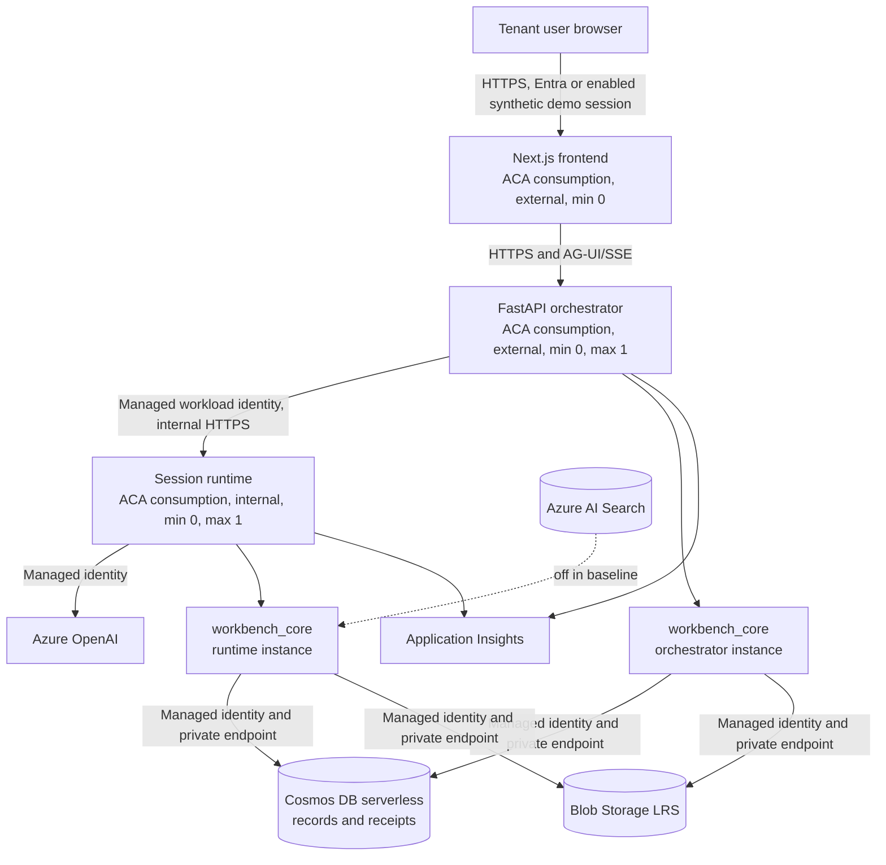

# Infrastructure Capability

> **Authority:** Canonical capability detail subordinate to [CSA Workbench — Authoritative Product and System Design](../design.md)  
> **State:** Target design, reconciled with integrated `master@1fcaac6`  
> **Applies to:** Azure and local topology, workload boundaries, private data paths, deployment, cost, observability, and degraded infrastructure behavior  
> **Last reviewed:** 2026-07-14  
> **Issue:** [#15](https://github.com/DanGiannone1/personal-assistant-agent-harness/issues/15)

## The short version

CSA Workbench is a standalone workspace for solution architects, deployed as the smallest Azure system that
proves professional agent-application boundaries. The browser, authenticated orchestrator, and agent
runtime are separate workloads. Cosmos owns durable structured state, Blob owns durable bytes, and
compute owns only caches and scratch. Every compute workload can reach zero replicas when idle and
can recover because conversations, uploads, Engagement artifacts, and behavior receipts do not live
only in a container.

The baseline uses three Azure Container Apps consumption apps, Cosmos DB serverless, Blob Storage
LRS, separate managed identities, private data-store endpoints, Azure OpenAI over
identity-authenticated TLS, and Azure Monitor for operations. Search, Dynamic Sessions, ACA
Sandboxes, external MCP, IDA adapters, schedulers, and enterprise edge services are not baseline
dependencies. Azure OpenAI Private Link is an optional hardened profile, not a first-release gate.

This document owns infrastructure contracts and evidence. Product behavior remains owned by the
high-level design and sibling capability documents. Operational runbooks may describe the current
repository, but they do not redefine this target.

## Purpose and boundary

The infrastructure has to make five product truths credible:

1. A signed-in actor can reach CSA Workbench while its data stores remain off the public network.
2. A turn acts through an isolated application boundary, not by giving the browser or model direct
   access to data.
3. Durable work survives cold starts, scale-in, revision replacement, and harness replacement.
4. A user can retrieve a behavior receipt showing the context and tool outcomes for a turn.
5. Demo-scale usage has consumption economics rather than an always-warm compute floor.

The deployment is a reference implementation of CSA Workbench, not a generic agent platform. IDA, M365,
firm-knowledge, remote MCP, and other external adapters are excluded. A future adapter must enter
through CSA Workbench's authenticated application contracts and receives no global-owner, shared-key, or
direct-store bypass.

## Reference Azure topology



One VNet contains the Container Apps infrastructure subnet and a separate private-endpoint subnet.
Cosmos and Blob use private endpoints and private DNS. The frontend and orchestrator are the only
externally reachable application workloads; the runtime accepts only internal traffic and an
orchestrator workload identity. No VPN, NAT Gateway, Front Door, APIM, or premium workload profile is
required for the baseline.

The orchestrator remains externally reachable because the current browser streams directly from it.
A later same-origin backend-for-frontend may make the orchestrator internal, but that is a product
and threat-model decision, not required to prove the first release.

## Component and dependency contracts

| Component | Infrastructure contract | Authorized dependencies |
|---|---|---|
| Frontend | Responsive Next.js application, external ingress, zero minimum replicas, no durable local state | Orchestrator API; Entra browser flow; image pull only |
| Orchestrator | Public trust boundary, user/session binding, application APIs, server-side context composition, turn coordination, SSE proxy, receipt persistence, and one local `workbench_core` instance | Cosmos and Blob through its local core; internal runtime; Azure Monitor |
| Session runtime | Internal model/harness host, ephemeral workspace, rehydration, normalized AG-UI stream, bound product-tool adapter, and one local `workbench_core` instance | Cosmos and Blob through its local core; Azure OpenAI; Azure Monitor; Search only in a future approved profile |
| `workbench_core` package | One versioned application/domain implementation embedded in both Python workloads; no ingress or separate deployment | Repository adapters under the host workload's identity |
| Cosmos | Actors, personal state, Engagement aggregates, conversations, idempotency records, and behavior receipts | Private data plane; scoped managed identities only |
| Blob | Private chat uploads, Personal Library bytes, and durable Engagement artifact bytes | Private data plane; scoped managed identities only |
| Azure OpenAI | Model inference for the selected harness | Identity-authenticated TLS from the runtime; no API key |
| Application Insights / Log Analytics | Operational traces, metrics, logs, dashboards, and alerts | Telemetry exporters; never the sole product receipt store |
| Azure Container Registry | Immutable workload images | GitHub OIDC for build/publish; managed identity for pull |

`workbench_core` is a shared package, not a fourth workload. Manual REST calls use the orchestrator's
instance; agent tools use the runtime's instance. Both images are built from the same Git revision
and expose one application-contract version. The orchestrator checks that version when it establishes
a runtime session and refuses a mismatch; turn receipts record it. Cross-process correctness comes
from live authorization, Cosmos ETags, and same-aggregate idempotency receipts, not shared memory or
trust in the caller. Neither instance may contain surface-specific policy.

The frontend has no Cosmos, Blob, or model role. The orchestrator and runtime use different managed
identities with only the repository permissions their local core instance requires. Image-pull
identity is not evidence of runtime data-plane identity. Role assignments are scoped to named
resources or containers where Azure permits; an automation path must fail instead of widening a role
to the subscription.

## Workload and scale contract

The baseline deploys exactly three Container Apps consumption workloads:

| Workload | Ingress | Minimum replicas | Maximum replicas | Reason |
|---|---:|---:|---:|---|
| Frontend | External | 0 | Small bounded value | Stateless presentation can scale independently |
| Orchestrator | External | 0 | 1 | Current session ownership and coordination must not split across processes |
| Session runtime | Internal | 0 | 1 | Current harness/checkpointer/workspace state is process-local cache |

Maximum one is an honest first-release limit, not the intended enterprise ceiling. Multiple logical
users may share the one runtime process, with per-session locks preventing concurrent turns in the
same conversation. The runtime must not advertise per-user container or microVM isolation.

The architecture may raise either maximum only after durable ownership, idempotency, concurrency,
and rehydration no longer depend on one process. Sticky routing alone is not sufficient proof.
Dynamic Sessions are excluded because the platform's warm-session floor conflicts with idle compute
at zero. ACA Sandboxes remain preview investigation material and are neither a state store nor a
release dependency.

Cold starts are expected. The UI must present a bounded connecting/starting state, and request
timeouts must allow a cold frontend, orchestrator, and runtime chain without masking a genuine
failure. A cold start may delay work; it may not lose durable work or duplicate a command.

## Durable state and rehydration

Scale-to-zero is safe only when losing a container cannot lose user-important state:

| State | System of record | Compute behavior |
|---|---|---|
| Engagements, personal records, actors, context source data | Cosmos | Read live through a local application-core instance |
| Conversations and harness-neutral message log | Cosmos | Replayed to the selected harness after cold start |
| Turn context snapshot and behavior receipt | Cosmos | Persisted before/during/finally around runtime invocation |
| Chat uploads | Blob with Cosmos metadata | Materialized into runtime scratch on demand |
| Engagement artifacts | Blob with Engagement metadata | Streamed through authorized application APIs |
| Harness checkpointer, caches, intermediate files | None | Disposable and reconstructable |

The runtime workspace is never the only copy of an upload or accepted deliverable. Saving a private
draft to an Engagement is an explicit Blob plus metadata operation governed by
[Documents and retrieval](documents-retrieval.md). A runtime scale-in, failed revision, or harness
swap may discard scratch but must not silently discard a conversation, upload, artifact, or receipt.

A session record is actor-bound and durable. The orchestrator never decides ownership from a local
map after restart. Rehydration checks the authenticated actor, loads the conversation and referenced
uploads, establishes the selected harness, and only then accepts a new turn.

## Turn lifecycle and behavior receipts

The behavior receipt is product evidence; Application Insights is operational evidence. Both share
correlation IDs, but one cannot substitute for the other.

A turn follows this infrastructure sequence:

1. The orchestrator authenticates the actor and verifies the durable conversation binding.
2. It creates `turnId` and W3C trace context, loads the trusted context sources, and persists a
   `pending` receipt containing the immutable safe context snapshot.
3. It calls the internal runtime with user text kept distinct from trusted context, plus bound actor,
   conversation, context, turn, harness, and trace identifiers.
4. The runtime emits normalized AG-UI events. The orchestrator forwards them to the browser while
   collecting structured tool events and terminal state.
5. The orchestrator records each tool's safe arguments, structured outcome, timing, and correlation.
6. A `finally` path writes exactly one terminal status for completion, cancellation, timeout,
   disconnect, runtime failure, or unknown commit state.
7. The authorized trace API returns the stored receipt and context-inspector projection. Another
   actor receives the same not-found behavior as for an unknown receipt.

The minimum durable receipt contains:

```text
turnId, traceId, conversationId, actorId, optional Engagement id
createdAt, completedAt, terminalStatus
gitSha, flowCoreContractVersion, harness, model deployment
contextId, safe context snapshot, context hash
input message id and optional content hash
tool calls: call id, name, redacted arguments, structured outcome, duration
error class and reconciliation state when applicable
```

Full document contents, credentials, access tokens, raw hidden reasoning, and unrestricted tool
payloads do not belong in telemetry. The private transcript owns message content; the receipt may
reference message IDs. Receipt retention and redaction are explicit configuration with a documented
default, not accidental consequences of Log Analytics retention.

Operational spans carry `traceId`, `turnId`, `conversationId`, revision, harness, dependency, and
outcome so operators can move from a user-visible receipt to correlated infrastructure telemetry.

## Local and Azure topology

Local development preserves service and contract boundaries without requiring access to private
production stores.

| Concern | Local profile | Azure reference profile |
|---|---|---|
| Frontend, orchestrator, runtime | Three processes or Compose services | Three Container Apps consumption apps |
| Structured data | Cosmos DB emulator | Cosmos DB serverless, private endpoint |
| Durable bytes | Azurite using the Blob adapter | Blob Storage LRS, private endpoint |
| Model | Azure OpenAI with developer identity, or an explicitly selected deterministic stub | Azure OpenAI with runtime managed identity |
| Search | Disabled | Disabled |
| Conversion | Disabled by default; text formats remain usable | Optional Content Understanding profile |
| Identity | Synthetic demo identities; optional developer Entra | Tenant Entra plus disable-able synthetic identities |
| Receipts | Local durable store/JSONL projection using the production schema | Cosmos receipts plus Azure Monitor correlation |

Emulator keys are allowed only in the explicitly selected local profile. The application must refuse
key-auth configuration in an Azure/production profile. A developer laptop never requires a firewall
exception, VPN, or direct path to the Azure Cosmos or Blob account.

Local startup provisions emulator containers, seeds deterministic synthetic data, starts the three
services with the same public/internal API assumptions, and exposes health and receipt inspection.
Reset recreates a known local state without contacting Azure data services. The only allowed remote
dependency in the ordinary local profile is Azure OpenAI when the developer deliberately selects it.

## Security essentials

Infrastructure enforces the boundaries detailed in [Identity and access](identity-access.md):

- The real-user path accepts only validated tokens from the configured Entra tenant and audience.
- Synthetic demo identities are a separate realm, carry only synthetic data, and can be disabled by
  runtime configuration without rebuilding images.
- Cosmos and Blob have public network access disabled, private DNS configured, and local/shared-key
  authentication disabled.
- Azure OpenAI uses managed identity and TLS in the baseline. A model private endpoint is an optional
  hardened deployment profile, not a first-release product gate.
- Workload-to-workload access is identity-based. Internal ingress is defense in depth, not the only
  authorization check.
- The browser never receives a data-store credential, model credential, managed-identity token, or
  direct Blob URL that bypasses CSA Workbench authorization.
- GitHub Actions uses workload identity federation. Long-lived `AZURE_CREDENTIALS`, registry admin
  credentials, and publish profiles are not part of the target.
- Secrets and connection material never appear in image build arguments, public frontend variables,
  logs, receipts, shell process arguments, or committed environment examples.
- Health endpoints reveal availability only. Diagnostics and receipt APIs remain authenticated and
  actor-scoped.

Private endpoints are created declaratively before public access is disabled or workloads are
started. Blob containers are control-plane/IaC resources, not best-effort application startup side
effects. Private DNS resolution and managed-identity data access are deployment acceptance checks.

## Cost boundary

The demo target remains below approximately `$100/month` at representative usage, with idle compute
consumption at zero. The architecture supports that target by excluding fixed-cost services that do
not prove the product.

Expected baseline cost drivers are:

- private endpoints and Azure Container Registry Basic as small fixed infrastructure costs;
- Cosmos serverless request units and storage;
- Blob capacity, operations, and transfer;
- Azure OpenAI tokens;
- Container Apps CPU/memory while requests are active; and
- Application Insights / Log Analytics ingestion and retention.

Telemetry uses sampling, bounded attributes, short intentional retention, and a daily ingestion cap.
Azure budgets alert at useful thresholds before the target is exceeded. No component silently
upgrades to a premium or always-on SKU.

Cost is demonstrated through two kinds of evidence:

- every infrastructure change statically verifies zero minimum replicas, consumption/serverless
  tiers, bounded maxima, and absence of excluded fixed-cost resources; and
- a periodic deployed-profile observation verifies all three workloads reach zero, cold-start again,
  and show no idle compute consumption over the agreed observation window.

The 24-hour idle/billing observation is periodic deployment-profile evidence when infrastructure or
platform behavior changes. It is not a ceremony required for every code or documentation release.
Exact regional price estimates are planning inputs; actual Azure cost and replica metrics are the
oracle.

## Observability essentials

The baseline provisions a workspace-backed Application Insights resource and connects Container Apps
platform logs. Application instrumentation emits distributed traces and bounded metrics from both
orchestrator and runtime.

Required operational signals include:

- turn count, terminal status, latency, timeout, cancellation, and disconnect;
- tool outcomes grouped by `committed`, `noop`, confirmation, ambiguity, denial, conflict, and failure;
- frontend-to-orchestrator and orchestrator-to-runtime request latency;
- cold-start and rehydration duration;
- truncated or terminal-less SSE streams;
- Cosmos latency, request units, throttling, ETag retries, and failures;
- Blob upload/download/delete latency and failures;
- Entra and workload-auth rejection count without token contents;
- Container App replicas, restarts, revision, and resource use; and
- telemetry ingestion and Azure budget thresholds.

Alerts focus on product-impacting symptoms: sustained failed turns, missing terminal receipts,
private dependency failures, repeated auth failures, Cosmos throttling, Blob failure, crash loops, or
unexpected nonzero idle replicas. Dashboards are useful operational views, but a dashboard is not an
acceptance oracle and does not replace raw receipt/state reconciliation.

## Optional services and degraded modes

Optional infrastructure must not turn absence into a plausible but false success.

| Dependency state | Required behavior |
|---|---|
| Search disabled | Core navigation, CRUD, direct authorized document reads, and artifact operations remain available; semantic retrieval reports unavailable |
| Search failure | Return a structured retrieval failure; do not return an empty grounded answer or broaden scope |
| Content Understanding disabled | Text/markdown/CSV/JSON remain directly usable; binary extraction is visibly unavailable while durable original handling follows its own contract |
| Conversion failure | Preserve the original when upload committed; record conversion failure and never present placeholder markdown as extracted content |
| Azure OpenAI unavailable | Manual CSA Workbench remains available; the turn ends visibly with a failed receipt and no narrated success |
| Session runtime cold or replaced | Rehydrate conversation and uploads; scratch may be lost; do not retry a non-idempotent command blindly |
| Application Insights unavailable | Behavior receipt still reaches a terminal state; telemetry export failure is logged/alerted separately |
| Cosmos unavailable | Fail readiness or the affected operation; never fall back to process memory or a local file in Azure |
| Blob unavailable | Fail the byte operation and reconcile metadata; never create an artifact record that implies available bytes |

Search remains off in the reference profile. Enabling it requires a separate approved design showing
source-scoped authorization, managed-identity data-plane access, private-network posture, rebuild and
deletion behavior, and accepted fixed cost. A free public/key-based Search service is not an allowed
shortcut.

Content Understanding may use the same identity-authenticated Foundry boundary as model inference.
It remains optional because direct text files and the core Engagement product must work without a
conversion service.

## Deployment direction

Bicep is the declarative source for resource topology, configuration, role assignments, private
endpoints, private DNS, containers, diagnostics, budgets, and outputs. A thin shell or task wrapper
may validate inputs, build images, invoke Bicep, update revisions, and run deployment-profile checks;
it does not reproduce the resource graph imperatively.

The delivery sequence is:

1. GitHub Actions authenticates to Azure through OIDC with a narrowly scoped deployment identity.
2. It builds frontend, orchestrator, and runtime images and publishes immutable Git-SHA tags.
3. Bicep validation and an environment-scoped preview/what-if expose resource and RBAC changes.
4. Approved deployment applies the declared infrastructure and workload configuration.
5. Container Apps update to the exact SHA images; no deployment depends on `latest` moving.
6. Health, identity, private-path, durability, receipt, and deployed Deep Agents smoke checks run at
   the depth appropriate to the change.
7. The release record captures revision, SHA, configuration profile, evidence, and unresolved gaps.

Frontend public configuration is built from nonsecret environment-specific values. Runtime feature
flags such as synthetic-demo availability are server-owned runtime configuration; changing them does
not require rebuilding the frontend image. Container App updates supply the complete authoritative
environment set so an update cannot silently erase required variables.

The baseline provisions all resources it claims to own or accepts explicit resource IDs for declared
bring-your-own dependencies. It never infers a resource name and widens scope when the resource is
not found. Rollback selects a previously proven immutable revision; it does not retag an image.

## Intentional simplifications

The first professional release intentionally uses:

- one Azure region and one Container Apps consumption environment;
- one active orchestrator replica and one active runtime replica at most;
- cold starts instead of a warm session floor;
- logical per-session isolation in one runtime process, without arbitrary code execution;
- Cosmos serverless and Blob LRS rather than provisioned throughput or premium storage;
- Azure OpenAI identity-authenticated TLS without requiring Private Link;
- Deep Agents as the deployed primary and Copilot as local portability evidence;
- Search and conversion absent from the baseline;
- Application Insights plus user-retrievable Cosmos receipts rather than an enterprise SIEM; and
- synthetic demo data and one internal tenant.

These choices simplify the deployment without weakening the product's claims about identity,
authorization, durability, truthful outcomes, private stores, or traceability.

## Deferred production hardening and non-goals

The following are explicitly not first-release infrastructure requirements:

- multi-region active/active or active/passive topology, automated disaster recovery, formal RTO/RPO,
  availability SLA, or zone-redundant capacity;
- Front Door, WAF, APIM, VPN, NAT Gateway, dedicated egress, or enterprise DNS architecture;
- Dynamic Sessions, ACA Sandboxes, per-user microVMs, GPU workloads, or premium workload profiles;
- orchestrator/runtime horizontal scaling, distributed locks, global load testing, or sticky routing;
- private Azure OpenAI as a mandatory gate, private managed-identity Search, or enterprise semantic
  retrieval;
- customer-managed keys, HSM, confidential computing, Defender rollout, enterprise SIEM/DLP, legal
  hold, or compliance certification;
- automated backup/restore programs beyond documenting Azure-native capabilities and preserving the
  source-of-truth design;
- an always-on scheduler, workflow engine, reminder loop, notification service, or ACA cron job;
- external tenants, guests, customer federation, IDA deployment, remote MCP, or general connector
  infrastructure; and
- enterprise analytics, chargeback, capacity planning, or a broad platform abstraction.

Deferral is not risk acceptance. If a release claim or real data set requires one of these controls,
the scope returns for an explicit product, architecture, security, and evidence decision.

## Current integrated state versus target

Static inspection of `master@1fcaac6` found useful foundations but not a trustworthy implementation
of this target. Runtime behavior remains **UNVERIFIED** without separate behavioral evidence.

### Deployment and topology blockers

- `infra/deploy.sh:438-465` expands `SESSION_ENV_VARS` on the default scale-to-zero path, but the
  array is defined only in the opposite session-pool branch at `infra/deploy.sh:480-503`. The default
  deployment path is statically inconsistent.
- `infra/deploy.sh:326-341` claims Blob private access, disables storage public access, and then
  performs a best-effort data-plane filesystem create. The script creates only the Cosmos private
  endpoint at `infra/deploy.sh:174-181`; it does not declare the asserted Blob endpoint or DNS path.
- `artifact_store.py:64-70` attempts best-effort container creation and suppresses failure. The
  artifact container is not an IaC-owned resource.
- `infra/deploy.sh:641-665` permits three orchestrator replicas while
  `session_manager.py:109-112` stores ownership in process memory and `app.py:332-343` authorizes
  through that map. Requests can disagree after restart or load balancing.
- `.github/workflows/deploy.yml:3-14` targets `main`, requests zero ready Dynamic Sessions despite the
  documented platform floor, and does not represent the selected `master` baseline. Its session-pool
  update at `.github/workflows/deploy.yml:66-95` also omits the complete required environment list.
- `.github/workflows/deploy.yml:23-26,61-64` uses a long-lived `AZURE_CREDENTIALS` secret rather than
  GitHub OIDC.
- `infra/deploy.sh:287-303` widens Cognitive Services User to the subscription when the intended
  resource cannot be found. The target must fail closed.
- The default plain runtime disables pool auth with `POOL_AUTH=off` at
  `infra/deploy.sh:626-629`. Internal ingress alone does not satisfy the target workload-identity
  contract.
- `infra/deploy.sh:891` names `setup_knowledge_base.py`, which is absent from the integrated tree.

### Durability and observability blockers

- Conversations and uploaded chat files remain process/workspace state. The decided target is
  documented in `master@1fcaac6:docs/session-state-design.md:8-29`, but rehydration is not implemented.
- The browser constructs and injects context text at
  `frontend/src/hooks/useAgentSession.ts:484-507`; the orchestrator does not persist one authoritative
  server-composed context snapshot before model invocation.
- The production deployment passes Application Insights settings to the runtime at
  `infra/deploy.sh:482-496`, but not to the orchestrator environment at
  `infra/deploy.sh:602-618`.
- `session-container/tracing.py:93-105` enables HTTP instrumentation while disabling logs and metrics;
  it does not create turn/tool spans.
- Harness trace helpers return unless a direct `trace` logger handler exists
  (`session-container/agent.py:61-79`, `session-container/agent_deepagents.py:68-82`), while
  `session-container/trace_logging.py:32-56` does not install that handler.
- `app.py:385-391` returns local trace file paths, not an actor-authorized durable behavior receipt.
  R19-style production trace retrieval is therefore absent.

### Security, local-development, and documentation conflicts

- Enabling Search retrieves an admin key and injects it into workload environment variables at
  `infra/deploy.sh:352-397,497-502,619-624`; Search must remain off.
- `mcp_server.py:1-14` exposes a shared-key remote path and later calls removed global-owner
  `appdb.load()` / `appdb.update()` APIs. It is excluded from CSA Workbench and may not serve as an IDA path.
- `docker-compose.yml:5-35` provides no Cosmos emulator, Azurite, or complete Cosmos/Blob environment,
  so it is not the target local parity stack.
- `master@1fcaac6:docs/development.md:7-16` directs laptops to a real Cosmos firewall path, while
  `master@1fcaac6:docs/deployment.md:36-46` says the account is private and local work uses the emulator. Emulator
  key support exists at `session-container/appdb.py:62-75`, but the local topology does not wire it.
- `master@1fcaac6:docs/architecture.md:139-145` and `master@1fcaac6:docs/deployment.md:3-18` call Dynamic Sessions the production
  runtime, while `infra/deploy.sh:76-83,437-473` defaults to a plain scale-to-zero app.
- `master@1fcaac6:docs/deployment.md:50-51` describes ADLS, Search, OpenAI, and ACS as public, conflicting with the
  current private-store requirement and with nearby storage comments.
- The one-warm-session floor acknowledged at `master@1fcaac6:docs/deployment.md:89-96` conflicts with the
  all-compute-zero requirement and is why Dynamic Sessions is not the target baseline.

These findings are implementation inputs. They do not authorize patching the current deployment
incrementally or treating static review as proof that a revised deployment works.

## Behavioral and deployment oracles

Verification reconciles the real UI, authoritative state, behavior receipt, and Azure observations.
A successful command or healthy dashboard alone is not proof.

| Behavior | Starting condition and action | Expected result and evidence |
|---|---|---|
| Reachability and sign-in | Deploy baseline; sign in as two Entra actors and enabled synthetic actors | Frontend and API are reachable; tenant/audience are enforced; each actor sees only authorized state |
| Demo disable | Disable synthetic login by runtime configuration without rebuilding images | Synthetic login UI/API becomes unavailable; Entra remains functional; synthetic data remains inaccessible through that path |
| Private Cosmos and Blob | Attempt access from an untrusted public host, then exercise the same paths through workloads | Public/key paths fail; managed identities inside ACA succeed through private DNS/endpoints |
| Least privilege | Exercise each workload dependency and inspect role assignments | Frontend has no data roles; orchestrator/runtime can perform only their declared operations; no subscription-wide fallback exists |
| Scale to zero | Leave all workloads idle for the platform observation window | Frontend, orchestrator, and runtime reach zero replicas; no warm pool exists; first request cold-starts successfully |
| Periodic idle cost | For an infrastructure/platform change, observe the agreed 24-hour idle window and Azure cost data | Compute consumption is zero while idle and total demo-profile cost remains within the agreed target; this is periodic, not every-release evidence |
| Durable conversation | Create a conversation and turn, allow runtime scale-in or replace its revision, then continue | Transcript rehydrates and the next turn continues without losing or duplicating durable messages |
| Durable chat upload | Upload a private file, force runtime replacement, then reopen/use it | Blob bytes and Cosmos metadata remain actor-private and materialize into new scratch on demand |
| Durable Engagement artifact | Save a reviewed artifact, replace all compute revisions, and open it as another authorized member | Bytes and metadata survive; unauthorized and nonmember reads remain indistinguishable from not found |
| Successful receipt | Run a turn with a committed tool and retrieve its receipt | Stored context, tool call, structured outcome, revision, harness, model, timing, and terminal status reconcile with authoritative state |
| Failed/no-op receipt | Deliberately trigger failure and no-op paths | Receipts preserve the real outcomes; UI and assistant do not narrate success; exactly one terminal state exists |
| Receipt isolation | Actor B requests actor A's turn receipt | Response is the same not-found behavior as an unknown receipt |
| Runtime dependency failure | Make model or runtime unavailable during a turn | Manual CSA Workbench remains usable; turn fails visibly; pending receipt becomes a terminal failure/unknown state; no blind mutation retry occurs |
| Telemetry degradation | Disable or break the App Insights exporter during a turn | Cosmos behavior receipt still completes; telemetry failure is operationally visible |
| Search absent | Run baseline and ask for semantic retrieval | Search resources/credentials are absent; capability reports unavailable; navigation, CRUD, artifacts, and direct authorized reads still work |
| Conversion absent/fails | Upload supported text and a binary source with conversion disabled or failing | Text remains usable; binary original follows its durable contract; extraction failure is explicit and never presented as grounded content |
| Local parity | Start emulators and all three workloads, seed/reset twice, and run the core journey | No Azure data store is contacted; repeat runs begin from identical state; receipt and API schemas match Azure |
| Immutable deployment | Deploy a commit through the approved pipeline | OIDC authenticates, exact SHA images run, Bicep outputs match configured endpoints, and no `latest` tag determines a revision |

Static IaC validation, image inspection, lint, and policy checks support these oracles but do not
replace the deployed behavior they describe. The deployed Deep Agents profile runs when deployment,
identity, private networking, durability, receipt, or scale behavior changes. Ordinary product
releases use proportionate evidence rather than repeating the 24-hour cost observation as ceremony.
