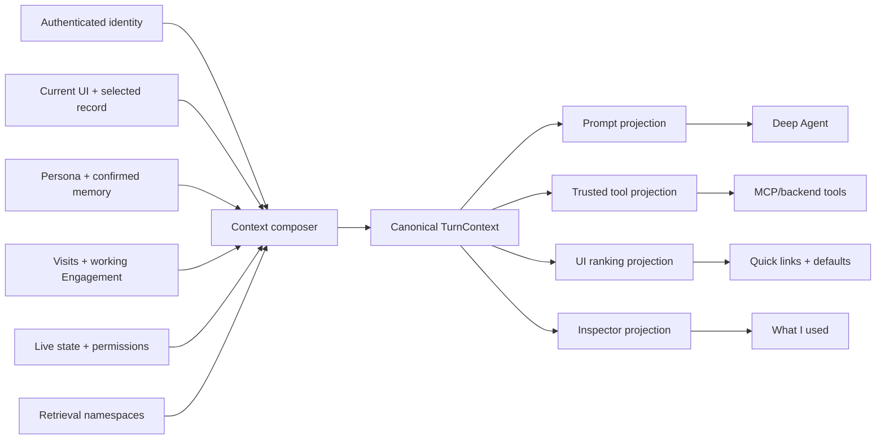

# Context Reference Architecture

> **Status:** target architecture assembled from the roadmap, personalized-navigation design,
> Projects prototype, Engagement work, harness seam, and MCP direction. It is not yet fully built.

**Context is the application's turn-scoped explanation of who is acting, where their work is
focused, what durable preferences apply, and which live facts matter now.** Application code
composes it from authenticated and permission-trimmed sources. The UI, agent, and tools consume
projections of that same bundle.

Context is foundational because it powers both sides of the product:

- Without an agent, it ranks quick links, restores working Engagements, applies defaults, and
  explains personalization.
- With an agent, it grounds language, selects safe defaults, scopes retrieval and CRUD, applies
  persona/conventions, and records exactly what influenced a turn.

The defining rule is:

> **Context shapes behavior; it never grants access and never replaces a live read.**

## Context at a glance



One composer creates one immutable `TurnContext` snapshot per turn. Different consumers receive
least-privilege projections; they do not independently reconstruct context.

## The core invariants

1. **Identity is authenticated, not inferred.** User ID, session ownership, memberships, and
   permissions come from trusted transport and backend state.
2. **Stored is not grounded.** Persona and confirmed memory are durable. Tasks, risks, dates,
   permissions, and current UI are queried or computed live rather than copied into memory.
3. **Context never authorizes.** It may rank permitted scopes and targets, but each read or mutation
   performs a live authorization check.
4. **Everything durable is legible.** Users can view, edit, and delete persona, memories,
   conventions, pins, working context, and standing approvals.
5. **No silent memory.** An agent may propose durable memory, but only explicit confirmation stores
   it.
6. **One turn, one explainable snapshot.** Every applied item records source, scope, reason,
   freshness, and precedence. The inspector renders that actual snapshot.
7. **Minimal by default.** Inject small summaries and pointers. Fetch records and document content
   lazily through permissioned tools.
8. **Conversation is not durable context.** A LangGraph checkpointer preserves thread continuity;
   it is not the source of persona, workspace memory, permissions, or live application facts.

## The canonical `TurnContext`

The logical schema is:

```json
{
  "id": "ctx-...",
  "asOf": "2026-07-13T14:00:00Z",
  "actor": {"id": "user-7", "displayName": "Dan"},
  "ui": {
    "destinationId": "destination:engagement:eng-42:risks",
    "selectedResource": null
  },
  "scope": {
    "kind": "engagement",
    "id": "eng-42",
    "reason": "current_view"
  },
  "persona": {"role": "Engagement lead", "tone": "concise"},
  "memories": [],
  "conventions": [],
  "working": {"engagementId": "eng-42", "recentDestinationIds": []},
  "live": {
    "today": "2026-07-13",
    "timezone": "America/New_York",
    "salience": []
  },
  "retrieval": {"namespaceIds": ["personal:user-7", "engagement:eng-42"]},
  "applied": [],
  "omitted": []
}
```

This is a conceptual schema, not a promise that every projection exposes every field.

### Context classes and storage

| Class | Examples | Source of truth | Delivery rule |
|---|---|---|---|
| Identity | User ID, display name, memberships | Auth/session and account store | Trusted runtime only |
| Persona | Role, tone, output preferences, language | User-editable profile | Small prompt projection |
| Working context | Active Engagement, recent destinations, selected record | Per-user context doc plus current UI | UI, prompt, and tool projections |
| Durable memory | Confirmed preferences and decisions | User context doc | Relevant scoped items only |
| Engagement conventions | Language, reporting rules, delivery norms | Engagement document | Only when the turn touches that Engagement |
| Approval policy | Standing grants and restrictions | User context/policy store | Trusted tool projection; safe summary in inspector |
| Live grounding | Current route, records, due/blocked signals, membership | Queried from application state | Small computed summary; full data via tools |
| Documents | Session files and indexed Library content | File/search stores | Pointers in context; content through cited retrieval |
| Conversation | Recent messages and tool results | LangGraph checkpointer | Model thread only, bounded separately |
| Behavioral signals | Visits, recency, bounded frequency, pins | Per-user context doc | Ranking features; raw history omitted from prompt |

Personal and Engagement data remain separate authorization scopes. Retrieval indexes must carry
owner/Engagement fields and apply mandatory filters before returning content.

## Four projections from one bundle

### Prompt projection

The model receives only what improves interpretation or response style:

- Actor display name, never credentials or bearer tokens
- Date and timezone
- Validated current view and selected record label
- Resolved working scope with reason
- Relevant persona fields
- Relevant confirmed global memories
- Conventions for the active Engagement
- Small live summaries such as "2 overdue actions," not full record collections

Documents, full task lists, membership lists, standing-approval tokens, and raw visit history stay
out. The agent uses tools when it needs those facts.

### Trusted tool projection

MCP/backend tools receive opaque runtime context outside model arguments:

- Actor ID and session ownership
- `contextId` and snapshot time
- Validated UI destination and scope hints
- Effective capability hints and retrieval namespace filters
- Workspace binding

These are still hints, not cached authorization. Every tool re-reads current membership and relevant
state before acting.

### UI ranking projection

The app receives safe features and explanations for:

- Personalized quick links
- Working Engagement restoration
- Form defaults
- Salience badges

It contains destination IDs, scores, and reason codes, not model prompt text.

### Inspector projection

The "What I used" panel renders exactly what the composer emitted:

- Applied persona fields and memories
- Engagement conventions and why they matched
- Live grounding summaries and freshness
- Scope selection and precedence decisions
- Navigation candidate scores and context boosts when navigation ran
- Omitted or unavailable sources with reasons

Secrets, internal authorization tokens, inaccessible resource names, and hidden policy data are
redacted at composition time. The inspector never reconstructs context later from mutable state.

## Precedence is typed, not one universal list

Different conflicts have different authorities:

### Authorization

Live policy and membership are an absolute ceiling. No instruction, convention, persona, memory, or
model decision can override them.

### Facts

Live application state and permission-filtered cited retrieval beat durable memory. A stored memory
that says a risk is open cannot override a live record that says it is mitigated.

### Instructions and style

```text
explicit instruction in this turn
  > applicable Engagement convention
  > user persona or confirmed global preference
  > application default
```

Specificity wins; within one level, the most recently updated applicable item wins. The inspector
shows the winner and the shadowed item.

### Scope resolution

```text
explicit stable scope or resource in the turn
  > currently selected record or Engagement
  > Engagement encoded by the current view
  > sticky working Engagement
  > personal/default scope
```

Scope resolution narrows interpretation but does not grant membership. CRUD still fails on an
ambiguous update/delete target; navigation may decisively pick from viable permitted destinations.

## Per-turn composition

The context composer runs at the authenticated session boundary, not in the browser and not inside
the model prompt:

1. **Authenticate.** Bind the actor and verify session ownership.
2. **Validate UI context.** Resolve the client-provided destination ID or route against the actor's
   live authorized destination catalog.
3. **Read durable context.** Load persona, confirmed memories, pins, working context, and standing
   approval metadata.
4. **Read applicable scope.** Load Engagement membership and conventions for candidate scopes.
5. **Compute live grounding.** Query current versions and derive small salience summaries such as
   overdue or blocked counts.
6. **Select relevant context.** Apply scope, precedence, freshness, and token/field budgets.
7. **Build projections.** Produce prompt, tool, UI, and inspector views from the same immutable
   snapshot.
8. **Emit trace.** After `RUN_STARTED`, emit `CONTEXT_APPLIED` before the first model or tool event.
9. **Execute.** The harness and tools reference `contextId`; tools reauthorize and read live state at
   call time.

A context bundle is immutable for explainability. Long turns may encounter changed state, so tool
results are authoritative and can report that the snapshot became stale. The next turn recomposes.

## `CONTEXT_APPLIED` event

The event makes the inspector evidentiary rather than decorative:

```json
{
  "type": "CONTEXT_APPLIED",
  "contextId": "ctx-...",
  "asOf": "2026-07-13T14:00:00Z",
  "scope": {"kind": "engagement", "id": "eng-42", "reason": "current_view"},
  "applied": [
    {"kind": "convention", "id": "conv-3", "reason": "scope_match"}
  ],
  "live": [
    {"kind": "salience", "summary": "2 overdue actions", "freshness": "live"}
  ],
  "omitted": []
}
```

The trace event contains the inspector projection, not private tool context. Store the event or its
content hash with the turn trace so later audits can prove what was supplied.

## How navigation uses context

Navigation is the clearest non-agent consumer:

- Quick links deterministically rank permitted destinations using working scope, recency, bounded
  frequency, pins, salience, and profile defaults.
- A click navigates immediately and asynchronously writes one navigation event.
- Natural-language navigation retrieves semantically viable destinations first, then uses context
  to rank or pick within that set.
- Context cannot add an inaccessible destination or make an irrelevant candidate viable.

See [navigation-reference-architecture.md](navigation-reference-architecture.md).

## How CRUD uses context

CRUD works without pre-navigation:

- Creates may default to a clearly active Engagement.
- Updates and deletes use context to rank only authorized candidates but require a unique target.
- Approval policy comes from trusted tool context, not the prompt projection.
- The committed outcome states which scope was used and supplies a canonical destination.
- Only a committed result causes post-action navigation.

See [crud-reference-architecture.md](crud-reference-architecture.md).

## Durable context lifecycle

### Persona and preferences

Users edit persona directly in Settings. The agent may suggest a change, but it does not silently
infer and store one from ordinary conversation.

### Memory

1. The agent proposes a concise memory with scope (`global` or Engagement).
2. The backend returns a preview and confirmation token.
3. The user confirms, edits, or rejects it.
4. The canonical CRUD/policy service stores the confirmed item and audit record.
5. Future composition includes it only when relevant and reports why.

Fast-changing facts do not belong in memory. Store "status reports use French"; query whether a risk
is currently open.

### Behavioral context

Manual and agent navigation use one event contract. The backend atomically updates the capped visit
log and working Engagement. Users can clear history, pin destinations, and change the working scope.
Frequency signals are bounded and old visits decay.

### Standing approvals

Approvals are durable policy, not model context. The prompt may receive a safe summary, while the
full grant and any confirmation tokens remain in trusted tool context and are revalidated at use.

## LangGraph Deep Agents integration

The current harness creates a long-lived `AgentSession`, a static `SYSTEM_PROMPT`, local copied
LangChain tools, and an `InMemorySaver`. The target keeps the `AgentSession`/AG-UI seam but changes
where context and tools enter.

### Target turn flow

```text
session server
  -> authenticate actor and validate uiContext
  -> contextsvc.compose(...)
  -> RUN_STARTED
  -> CONTEXT_APPLIED
  -> Deep Agents middleware adds prompt projection for this turn
  -> model calls shared MCP tools
  -> MCP runtime binds trusted tool projection
  -> tool reauthorizes and reads live state
  -> structured TOOL_CALL_RESULT
  -> RUN_FINISHED
```

Implementation rules:

- Keep the static system prompt small, policy-oriented, and cacheable.
- Add the prompt projection dynamically for the current turn; do not concatenate bracketed context
  into browser-authored user text.
- Do not checkpoint injected context as if the user said it. Recompose it every turn.
- Keep `InMemorySaver` for conversation continuity only.
- Load the shared MCP tools through the Deep Agents harness rather than defining local `appdb` tools.
- Bind actor, session, workspace, retrieval scopes, and `contextId` in runtime/MCP transport, outside
  tool schemas visible to the model.
- Use the same context middleware and MCP contract for Copilot or future harnesses where their SDK
  permits; the resulting AG-UI stream remains harness-independent.
- Skills remain reusable procedural instructions. They may explain how to use context, but they are
  not a context store.

## Security, privacy, and consistency

- Permission-trim every source before composition, ranking, or retrieval.
- Reauthorize every tool call against live state; never trust a permission snapshot alone.
- Namespace Library search by actor and Engagement before multi-user rollout.
- Cap behavioral history and make it clearable.
- Keep raw documents and record collections out of prompt context unless explicitly retrieved.
- Redact secrets once, when creating projections, not ad hoc in the frontend.
- Log context IDs and provenance, not hidden chain-of-thought or picker reasoning.
- Treat missing context as an explicit degraded mode. Use safe defaults; do not invent values.
- Make context composition observable for latency, bundle size, source failures, and stale snapshots.

## Current repo and migration

The repo already contains the design principles but not one canonical implementation:

- [`docs/roadmap.md`](roadmap.md) defines stored-versus-live context, legibility, persona, memory,
  and the inspector.
- [`docs/personalized-navigation-via-user-context.md`](personalized-navigation-via-user-context.md)
  establishes that context ranks rather than gates.
- The Projects worktree prototypes per-user visits, working context, persona, memories, approvals,
  quick links, and a browser-rendered inspector.
- The Engagement worktree supplies the chosen domain model but retains the old single-owner identity
  assumptions.
- [`session-container/agent_deepagents.py`](../session-container/agent_deepagents.py) uses a static
  prompt and copied personal-only tools.
- [`mcp_server.py`](../mcp_server.py) uses a shared key and global owner document, so it cannot yet
  carry trusted multi-user tool context.
- Library search is not owner/Engagement-filtered.

The Projects prototype currently fetches a context bundle through the orchestrator, has the browser
turn it into prompt text, and renders an inspector from that fetched data. That does not prove what
the harness actually received. Composition and trace emission belong at the authenticated session
turn boundary.

Migration order:

1. Adopt Engagement terminology while retaining account-backed membership and per-user context
   primitives.
2. Define the `TurnContext` schema, projections, provenance types, and context service.
3. Move composition from the browser/orchestrator preamble path into the authenticated session turn
   boundary.
4. Add `CONTEXT_APPLIED` and drive the inspector from that event.
5. Use the UI ranking projection for personalized quick links and working-scope restoration.
6. Harden the backend/MCP layer with actor-bound identity and permissioned Engagement services.
7. Wire Deep Agents to dynamic context middleware and shared MCP tools; remove local copied tools.
8. Add owner/Engagement fields and mandatory permission filters to retrieval indexes.
9. Remove legacy prompt-text preambles, global-owner access, and reconstructed inspector data.

## Architecture checklist

- [ ] One authenticated composer creates one immutable context snapshot per turn.
- [ ] Prompt, tool, UI, and inspector projections derive from that same snapshot.
- [ ] Identity and permissions never come from model-visible arguments.
- [ ] Context ranks/defaults but never grants access or replaces live reads.
- [ ] Persona and memory are user-visible; memory requires explicit confirmation.
- [ ] Fast-changing facts remain live and are not copied into memory.
- [ ] Precedence is explicit for authorization, facts, instructions, and scope.
- [ ] Prompt context is minimal; records and documents are retrieved lazily.
- [ ] `CONTEXT_APPLIED` records exactly what the harness received.
- [ ] The inspector renders the event, not a later reconstruction.
- [ ] Tools reauthorize and read current state at execution time.
- [ ] Quick links, semantic navigation, CRUD, and retrieval consume the same context contract.
- [ ] Deep Agents receives dynamic context and shared MCP tools without checkpointing context as user
      speech.
- [ ] Library retrieval is actor- and Engagement-filtered.
