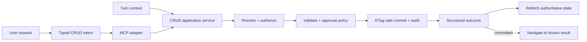

# CRUD Reference Architecture

> **Status:** target architecture. The final section maps it to the current repo and in-flight
> work; it is not a claim that every component below is shipped.

**Change anything from anywhere.** The assistant uses trusted user context to resolve the intended
Engagement and record, sends one typed command through MCP to the authoritative backend, and never
requires the user to open a page first. After the backend confirms an authorized commit, the UI
refetches truth and navigates directly to the canonical result.

## CRUD at a glance



The central rule is:

> **Context may resolve where and what the user means; only the backend may decide whether and how
> state changes.**

Navigation is not a prerequisite and is not a second agent decision. The committed CRUD result
already knows its destination.

## The five invariants

1. **No pre-navigation.** CRUD commands work from any page. Current view is context, not a workflow
   requirement.
2. **Trusted context.** Identity, permissions, session, and context defaults come from authenticated
   runtime state, never model-supplied IDs.
3. **One application service.** REST and MCP are adapters over the same validation, authorization,
   approval, mutation, and outcome logic.
4. **Commit before claim.** A record is changed only after an authorized concurrency-safe commit;
   the UI renders records only after re-reading backend state.
5. **Navigate only after success.** Only `committed` carries a grounded destination. Errors, no-ops,
   ambiguity, and pending confirmations do not move the UI.

## User experience

### Create from anywhere

"Add a high-priority action to prepare the steering deck" can be issued from Home, chat, or another
Engagement. Context identifies the active Engagement; the backend validates that default and the
actor's editor role, creates the action, and returns its canonical detail destination. The UI then
opens it.

### Update without opening the record

"Mark the launch security risk mitigated" does not first navigate to risks. The backend searches
only accessible Engagements, uses current and working context to rank strict matches, revalidates a
unique target, commits, and returns the updated risk destination.

### Destructive action

"Delete the completed launch actions" resolves candidates and policy but does not mutate. The
backend returns `needs_confirmation` with a preview and a signed, expiring confirmation token. Only
a later command presenting that token can commit, and the policy and record versions are checked
again.

## Scopes and records

The shared collaboration scope is an **Engagement**. Personal space remains available for records
that do not belong to an Engagement.

An Engagement combines the stronger parts of the in-flight implementations:

- Account-backed membership with `owner`, `editor`, and `viewer` roles
- Tasks, events, and documents where those general records remain useful
- Engagement fields such as stage, health, notes, milestones, risks, and actions
- Conventions, activity/audit entries, and destination metadata
- One ETag-safe document or aggregate boundary per Engagement

The architecture does not treat a display name in a members list as authorization. Membership is
bound to stable user IDs and checked on every read and mutation.

## Context-aware resolution

The [context service](context-reference-architecture.md) supplies a snapshot with provenance. CRUD
uses it in this order:

```text
explicit scope or stable ID in the turn
  > currently selected record or Engagement
  > Engagement encoded by the current view
  > sticky working Engagement
  > personal/default scope
```

These are resolution hints, not authority. The service first generates candidates from resources the
authenticated actor may access, then uses context to rank that permitted set.

Rules by operation:

- **Create:** may default to a clearly active Engagement and must report the chosen scope.
- **Update:** requires one resolved target. A close call returns `ambiguous`; it never updates the
  highest-scored guess.
- **Delete or bulk change:** requires one resolved target set plus approval policy. High contextual
  confidence does not waive confirmation.
- **Cross-Engagement request:** must carry an explicit authorized scope or resolve uniquely from the
  request. Working context cannot silently spread a mutation across scopes.

The backend re-resolves document-dependent references and rechecks membership inside any optimistic
concurrency retry.

## One service, multiple adapters

```text
Manual UI -> REST adapter ---------\
                                    -> CRUD application service -> repositories
Deep Agents -> MCP adapter --------/
Copilot     -> MCP adapter --------/
```

MCP is the agent-facing protocol, not the domain layer. REST does not call MCP over the network, and
MCP tools do not contain their own mutation rules. Both delegate to the same in-process application
service.

That service owns:

- Actor and session binding
- Context lookup and scope resolution
- Membership and role authorization
- Entity schemas, defaults, and cross-field validation
- Strict target resolution
- Confirmation and standing-approval policy
- Idempotency and expected-version handling
- ETag-safe mutation
- Activity/audit recording and side-effect outbox entries
- Structured outcome construction
- Canonical post-success destination generation

The repository layer owns storage mechanics. It does not decide authorization, user-visible
outcomes, or route behavior.

## Typed command contract

Agent tools should remain narrow and typed (`create_action`, `update_risk`, `delete_task`) while
normalizing into one internal command envelope:

```json
{
  "requestId": "req-...",
  "idempotencyKey": "turn-...:tool-...",
  "operation": "update",
  "resourceType": "risk",
  "targetRef": "security review",
  "scopeHint": {"kind": "engagement", "ref": "launch"},
  "changes": {"status": "Mitigated"},
  "expectedVersion": null,
  "approvalToken": null
}
```

The following values are **not** model arguments:

- Acting user ID
- Session/workspace ownership
- Effective permissions
- Trusted current route
- Standing approvals
- `contextId`

The REST or MCP adapter binds those from authenticated transport and the turn runtime. Treat every
model-provided scope, target, and field value as intent to validate, not trusted state.

## Execution pipeline

The application service executes commands in this order:

1. **Bind actor and context.** Load the authenticated actor and immutable turn-context snapshot.
2. **Build authorized candidates.** Query only personal and Engagement resources visible to that
   actor.
3. **Resolve scope and target.** Apply explicit references and contextual precedence.
4. **Authorize operation.** Viewers cannot mutate; editors can change records; owner-only operations
   include membership and Engagement administration.
5. **Validate.** Apply canonical field schemas, state transitions, and cross-field rules.
6. **Evaluate approval.** Check action class, risk, standing grants, and any confirmation token.
7. **Commit.** Use an idempotent ETag-protected mutation and re-run document-dependent checks after
   conflicts.
8. **Audit.** Write actor, operation, scope, before/after summary, approval basis, and request ID in
   the same aggregate commit when possible.
9. **Queue external effects.** Email, indexing, and other non-transactional work use an outbox or a
   compensating workflow after the state commit.
10. **Return outcome.** Construct one structured status and a canonical destination only when the
    mutation committed.

## Concurrency and idempotency

The current `appdb.update(mutator)` pattern supplies the right core behavior: read with ETag, run a
side-effect-free in-memory mutator, conditionally replace, and retry against fresh state after a
conflict.

The target service adds these requirements:

- Recheck authorization, membership, target resolution, and approval validity on every retry.
- Attach an idempotency key to every agent tool call so a retried stream or network request cannot
  duplicate a create.
- Store the resulting outcome or operation receipt long enough to replay duplicate requests.
- Bind confirmation tokens to actor, operation, scope, target IDs, proposed payload, expected
  versions, and expiry.
- Never perform email, search indexing, or other external side effects inside a retryable mutator.
- Raise a loud `conflict` after bounded retries rather than silently accepting last-write-wins.

## Structured outcomes

Marker strings are presentation, not a protocol. The application service returns one envelope:

```json
{
  "requestId": "req-...",
  "status": "committed",
  "operation": "update",
  "scope": {"kind": "engagement", "id": "eng-42"},
  "resource": {"kind": "risk", "id": "risk-7", "version": "etag-..."},
  "destination": {
    "id": "destination:engagement:eng-42:risk:risk-7",
    "title": "Security review",
    "route": "/engagements/eng-42/risks/risk-7"
  },
  "auditId": "activity-..."
}
```

| Status | Mutation? | Navigate? | Meaning |
|---|---:|---:|---|
| `committed` | Yes | Yes | Authorized mutation landed |
| `noop` | No | No | Request was already satisfied or changed nothing |
| `needs_confirmation` | No | No | Backend-issued preview/token must be accepted |
| `ambiguous` | No | No | More than one authorized target remains |
| `invalid` | No | No | Fields or transition violate the canonical schema |
| `not_found` | No | No | No authorized target matched |
| `forbidden` | No | No | A known scope or operation is not permitted |
| `conflict` | No | No | Concurrent change prevented a safe commit |
| `failed` | Unknown/No | No | Infrastructure failure; the client must refetch before claiming state |

Adapters translate this envelope to HTTP and AG-UI without parsing prose. Candidate lists, field
errors, previews, approval tokens, and retry guidance are typed optional fields on the same result.

## Confirmation and standing approvals

The backend, not the model, decides whether a mutation may commit.

- Create and low-risk update may commit immediately according to user policy.
- Delete, bulk mutation, membership changes, and high-risk transitions normally return
  `needs_confirmation`.
- Standing approvals are user-visible, revocable grants scoped to an action class and optionally an
  Engagement.
- A confirmation token is single-use and bound to the exact preview and record versions.
- Confirmation re-runs authorization, policy, and version checks before commit.
- Every policy decision and committed action writes an audit entry.

A boolean such as `confirmed=true` supplied by an agent is not proof of user approval.

## Navigate after completion

The order is deliberate:

1. Commit the record and audit.
2. Return `status=committed` with a grounded canonical destination.
3. Emit the structured tool result through AG-UI.
4. Invalidate and refetch authoritative app state.
5. Apply the returned route effect through the client router.
6. Record the resulting navigation event for future context.

There is no semantic `navigate` call before or after CRUD. The backend already knows the record it
committed. If client navigation fails, the mutation remains committed and visible after refetch; UI
presentation cannot roll back domain truth.

Agent-driven CRUD follows the destination by default. A manual form can deliberately remain in place
as a presentation choice, but it receives the same committed result from the same service.

## Deep Agents and MCP

The LangGraph Deep Agents harness should consume typed MCP tools backed by the application service:

- Remove local copied `appdb` CRUD implementations from `agent_deepagents.py`.
- Load MCP tools through the harness adapter and preserve their narrow schemas.
- Bind actor, session, workspace, and tool-context projection outside model arguments.
- Let the backend resolve Engagement defaults; do not prompt the model to guess a scope argument from
  the current route.
- Forward structured outcomes and route effects as AG-UI events.
- Keep the LangGraph checkpointer for conversation continuity, not durable application state or
  approval evidence.

Copilot and future harnesses use the same MCP tools. Harness parity becomes a property of shared
execution rather than duplicated code.

## Current repo and migration

Useful foundations already exist:

- [`session-container/appdb.py`](../session-container/appdb.py) has an ETag-safe retrying mutation
  primitive and fail-loud abort behavior.
- [`app.py`](../app.py) proves manual REST can mutate the same authoritative state as agent tools.
- The Projects worktree prototypes accounts, role-gated shared scopes, context, previews, standing
  approvals, and activity records.
- The Engagement worktree contributes the chosen domain vocabulary and stage, health, milestone,
  risk, action, and note model.
- [`mcp_server.py`](../mcp_server.py) proves private-network MCP transport.

The current implementations are not the target service:

- REST, Copilot, Deep Agents, and MCP duplicate validation and mutation behavior.
- The current MCP server uses one shared key and one global owner document, has no Engagement
  authorization, and allows immediate destructive operations.
- The current Deep Agents CRUD path uses copied tools and last-write-wins saves rather than the
  concurrency-safe shared service.
- The Projects branch leaves some scope inference and confirmation to model arguments.
- Structured status is still inferred from leading text markers.
- The two collaboration worktrees use incompatible identity and membership models.

Migration order:

1. Adopt Engagement as the shared scope while retaining account-backed roles and per-user context.
2. Extract canonical entity schemas and a CRUD application service above `appdb`.
3. Route existing REST handlers through the service.
4. Harden MCP with actor-bound authentication and make its tools thin service adapters.
5. Add structured outcomes, idempotency receipts, confirmation tokens, and audit behavior.
6. Port both harnesses to the same MCP tools and remove local CRUD implementations.
7. Add canonical post-commit destinations and structured AG-UI route effects.
8. Retire marker parsing, global-owner access, and model-controlled confirmation/scope defaults.

## Architecture checklist

- [ ] CRUD works from any view and never requires pre-navigation.
- [ ] Actor, permissions, session, and context are runtime-bound rather than model arguments.
- [ ] Context ranks only authorized candidates and never grants access.
- [ ] Creates report their chosen scope; updates/deletes require a unique target.
- [ ] REST and MCP delegate to one application service with one validation policy.
- [ ] Every mutation is idempotent, ETag-safe, retry-safe, and fail-loud.
- [ ] Authorization and approval are rechecked inside retries.
- [ ] Destructive operations require a backend-verifiable policy or confirmation token.
- [ ] Outcomes are structured and transport-independent.
- [ ] Only `committed` carries a destination and triggers navigation.
- [ ] The UI re-reads authoritative state and never renders from model claims.
- [ ] Deep Agents and Copilot use the same MCP-backed implementation.
