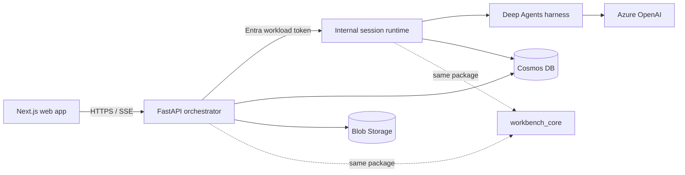

# CSA Workbench — Authoritative Product and System Design

> **Authority:** Canonical high-level product and system design  
> **Deployed application revision:** `807a0d6766036aa88dce8dcd9f16a2aabeb187b3`
>
> **Deployment verified:** 2026-07-16 in `csa-workbench-rg`
> **Issue:** [#18](https://github.com/DanGiannone1/csa-workbench/issues/18)

## Executive summary

CSA Workbench is an engagement workspace for Cloud Solution Architects. It gives each CSA a
personal portfolio and gives an authorized team one shared record for each customer Engagement.
The product is useful without AI: people can create, open, edit, and share Engagements directly in
the web application.

An embedded assistant is an additional control surface over the same records. It reads and changes
them through typed tools, and the UI trusts structured results plus authoritative state—not
assistant prose. This is the defining architecture rule:

> **A claim never outruns reality.**

The repository is also a practical reference for agent-harness systems: authenticated actor
binding, replaceable harnesses, structured control, durable product state outside compute,
responsive UI, and behavioral evidence. IDA material is comparative input only. CSA Workbench must
stand on its own as a useful solution-architect product.

## What problem it solves

Solution architects commonly reconstruct an engagement from status spreadsheets, notes, files,
chat history, and personal memory. That makes it difficult to answer basic delivery questions:

- Which Engagements need attention?
- What work is next?
- Who can see or change this record?
- Which artifacts belong to the Engagement?
- What did the assistant actually read or change?

CSA Workbench makes the **Engagement** the durable unit of collaboration. The assistant helps operate
that workspace; it does not become a second source of truth.

## MVP outcomes and boundary

The MVP proves:

1. a signed-in CSA has a personal portfolio of only their Engagements;
2. owners can create an Engagement and manage its membership;
3. owners and editors can update supported delivery fields while viewers remain read-only;
4. deterministic fake users exercise isolation and collaboration without being confused with
   tenant authentication;
5. real users from the configured Entra tenant can sign in;
6. the assistant lists, opens, and changes Engagement state through typed tools and structured
   results;
7. the UI remains polished and usable at wide, compact, and 390 CSS-pixel widths; and
8. the same revision deploys as a small, scale-to-zero Azure system with private data-store access.

The MVP deliberately does not include a workflow engine, generalized project management, external
tenant federation, enterprise search, generalized connectors, multi-agent orchestration, native
mobile/offline support, high-scale compute, multi-region recovery, or a broad production-hardening
program. These can be evaluated later only when they solve a demonstrated product need.

## Design principles

1. **The work lives here.** Cosmos and Blob hold durable product state; chat is a control surface.
2. **Claims follow evidence.** A successful-looking sentence cannot substitute for a committed
   result and authoritative readback.
3. **The product works without AI.** Core Engagement work has a complete manual path.
4. **One rule for every caller.** The six basic Engagement REST and agent commands—create, list,
   get, update, set status, and share/change membership—share the same application service for
   authorization, validation, mutation, and outcomes.
5. **Structured control only.** Routes, identifiers, commands, and results are typed and validated.
   User text and assistant text are never parsed as an application-control protocol.
6. **Identity is bound outside the model.** The model cannot choose its actor, session, or role.
7. **Durability is explicit.** Engagement records and artifacts survive compute replacement;
   conversation workspaces do not in this MVP.
8. **Frameworks adapt to the product.** Harness code does not own product rules or durable records.
9. **Failure remains visible.** Invalid, ambiguous, denied, missing, conflicting, and failed outcomes
   do not masquerade as success.
10. **Simplify ruthlessly.** Keep the smallest legitimate boundary that proves the product and defer
    hardening that does not.

## Users, scopes, and authorization

There are two application scopes:

| Scope | Owner | Visibility |
|---|---|---|
| Personal space | Signed-in actor | That actor only |
| Engagement | Engagement members | Current members, according to role |

Any signed-in user may create an Engagement and becomes its first owner.

| Engagement role | Read | Edit delivery fields and tasks | Manage artifacts | Manage identity and members |
|---|---:|---:|---:|---:|
| Owner | Yes | Yes | Yes | Yes |
| Editor | Yes | Yes | Yes | No |
| Viewer | Yes | No | No | No |

Non-members receive the same not-found behavior as an unknown Engagement. The final owner cannot be
removed or demoted. The server rechecks current membership for each operation; a browser route,
model argument, or stale context snapshot cannot grant access.

Each running environment selects one identity mode:

- `demo` uses deterministic, secret-backed synthetic users for local and automated evidence;
- `entra` accepts validated tokens from one configured tenant for the shared deployment.

The modes are not selectable per request and use separately configured application data stores.

## Domain and durable state

The MVP Engagement aggregate contains its identity, customer and description, delivery status and
reason, dates, members and roles, tasks, conventions, artifact metadata, and bounded activity.
Stable IDs are authoritative; display names are not identifiers.

| State | System of record | Lifecycle |
|---|---|---|
| Actor profile and personal view | Cosmos DB | Durable |
| Engagement aggregate | Cosmos DB, partitioned by Engagement | Durable |
| Engagement artifact bytes | Blob Storage | Durable |
| Artifact metadata and activity | Engagement aggregate in Cosmos DB | Durable |
| Agent session ownership | Orchestrator process | Ephemeral |
| Runtime conversation and workspace files | Runtime process/filesystem | Ephemeral |
| Search index | Not part of the MVP deployment | Absent |

The ephemeral session boundary is intentional and visible. After an orchestrator or runtime
replacement, the frontend creates a new session and durable Engagement work remains available.
Conversation history, chat uploads, local traces, and private drafting are not promised to survive
that replacement. Durable chat is a possible future capability, not a hidden MVP claim.

## Reference architecture



### Web application

The Next.js frontend owns presentation, responsive interaction, direct navigation, sign-in, and
reduction of the server-sent event stream. Browser state is untrusted. After a mutation it refreshes
authoritative application state instead of treating assistant wording as proof.

### Orchestrator

FastAPI is the public application boundary. It validates the configured identity mode, binds each
agent session to the authenticated actor, exposes manual application APIs, and proxies the event
stream. It calls the internal runtime with its managed identity and an Entra application role.

Session ownership is deliberately limited to one process and the deployed API therefore scales
between zero and one replica.

### Session runtime and harness

The internal runtime owns model invocation, harness adaptation, session workspace, and product-tool
binding. Deep Agents is the deployed primary harness. A Copilot adapter remains a local portability
check behind the stable `AgentSession` interface; it is not a release dependency.

The runtime receives the actor from the authenticated orchestrator call. Actor identity is never a
model-visible tool parameter. Azure OpenAI access uses the runtime managed identity.

### Shared application core

`workbench_core` is a dependency-light package used by both the orchestrator and runtime for six
basic Engagement operations: create, list, get, update, set status, and share/change membership. It
owns their role checks, target resolution, validation, mutation, and typed outcomes. REST handlers
and harness tools are adapters around that contract. Member removal, tasks, conventions, and
artifacts remain manual application paths and are not claimed as shared-core parity.

The core is a package, not another network service. Its two in-process instances coordinate through
Cosmos, not shared memory.

## A trustworthy agent turn

1. The orchestrator authenticates the actor and validates ownership of the session.
2. It sends the prompt and a validated navigation version to the internal runtime using workload
   identity.
3. The runtime keeps trusted actor/session data separate from user text.
4. The model selects a typed product tool.
5. The tool adapter binds the trusted actor and invokes the shared application core.
6. The core re-reads authorized state and returns a typed outcome.
7. The runtime emits structured tool and terminal events over SSE.
8. The UI applies structured navigation only when it is valid and not superseded, then refreshes
   authoritative state.

The deployed acceptance turn `List my engagements.` emitted a typed `list_engagements` call and a
successful `engagement.listed` result before describing the exact Cosmos-backed Engagement. No
keyword router or marker-string parser is in that path.

## Navigation and UI/UX

Engagements are the default landing surface. A CSA can use manual navigation immediately or ask the
assistant to navigate through a typed destination. The destination catalog validates route and
Engagement identifiers; chat text and raw assistant output never select a route.

The UI uses one coherent conversation in an embedded dock and a full assistant workbench. The host
portfolio and Engagement journey is verified at wide, compact, and 390 CSS-pixel widths; compact
host layouts move navigation and the dock into overlays. The standalone `/assistant` workbench still
uses a split layout below 1100 px and is not claimed as narrow-screen complete. The release target is
WCAG 2.2 AA intent, including keyboard reachability, non-color status cues, focus handling, reflow,
and reduced motion.

The detailed surface, breakpoint, state, and accessibility contracts live in
[UI/UX](capabilities/ui-ux.md) and [Navigation](capabilities/navigation.md).

## Azure deployment profile

The verified Azure deployment is intentionally small:

```text
Internet
  ├─ public Container App: frontend (0–1)
  └─ public Container App: API (0–1)
          └─ Entra-authenticated call
              └─ internal Container App: runtime (0–1)

VNet 10.42.0.0/24
  ├─ ACA infrastructure subnet 10.42.0.0/27
  └─ private-endpoint subnet 10.42.0.32/27
       ├─ Cosmos Sql private endpoint + private DNS
       └─ Blob private endpoint + private DNS
```

Cosmos and Blob public network access are disabled. The workloads use managed identity for ACR
pull, Cosmos data access, Blob data access, Azure OpenAI, and API-to-runtime authentication. Azure
OpenAI remains on identity-authenticated public TLS. The baseline does not add NAT Gateway, Azure
Firewall, Front Door, APIM, VPN, private ACA ingress, Search, or a warm session pool.

Every application-managed Azure resource is owned by `csa-workbench-rg`: the Container Apps
environment and apps, identities, VNet and private data paths, Cosmos, Blob, the Basic registry, and
the Azure OpenAI account/deployment. The registry preserves its East US location while the resource
group and remaining application resources use East US 2. Azure Container Apps necessarily creates
a separate `ME_...` resource group for platform-managed load-balancer infrastructure; Microsoft
owns that group and the application does not configure or depend on its individual resources.

Tenant policy also creates a Defender for Storage Event Grid topic and subscription; the verifier
tolerates their absence but validates their exact form when present because they are not
application-owned topology. Tenant governance may also create either no network security groups or
one exact East US 2 pair for the ACA and private-endpoint subnets. Application Bicep creates no
NSGs; guarded deployment validates and preserves the existing exact pair's subnet associations,
while the verifier rejects partial, extra, associated-NIC, custom-rule, wrong-subnet, and other
mismatched policy state.

Scale-to-zero cold starts of roughly 24 seconds were observed and accepted for this cost-minimized
MVP. All three images are pinned to the same full Git SHA.

## Quality and evidence

Evidence is behavioral and identifies its environment:

| Profile | What it proves |
|---|---|
| Contract tests | Domain rules, identity boundaries, structured events, deployment inventory |
| Local synthetic browser | Two-user isolation/collaboration, UI workflow, responsive layout, adversarial control cases |
| Local live agent | Real model selects typed tools and authoritative results match UI/state |
| Deployed real Entra | Tenant sign-in, internal workload identity, private Cosmos/Blob paths, Azure OpenAI turn |
| Visual review | Six representative screenshots and responsive hit-testing |

The deployed application revision has passed frontend root and `/assistant` responses, API health,
real-Entra `/auth/me`, Engagement and quick-link reads, session creation, authoritative Engagement
readback, and a typed Deep Agents turn. A Blob artifact was uploaded through the API, listed,
downloaded byte-for-byte, deleted, and confirmed absent while Storage public network access was
disabled. The live topology verifier also passed the exact app, network, DNS, identity, role,
resource-group containment, and immutable-image contract. The exact tenant-governance NSG pair was
present and passed its fail-closed policy-artifact contract.

Application revision `ce251fbbe03c6b99bc38e676a8be88e9f199f777` repeated frontend root,
`/assistant`, API health, real-Entra `/auth/me`, Engagement, quick-link, immutable-image, and exact
topology checks. Desktop and 390px live-browser checks also proved the repaired Microsoft sign-in
color, 4.525:1 contrast, zero horizontal overflow, no page/console errors, and redirect to the
Microsoft login host. The deployed Next.js 16.2.10/PostCSS 8.5.20 dependency baseline had zero npm
audit findings, and foundation deployment preserved the exact tenant-governance NSG pair. The
typed-agent and Blob round trips in the preceding paragraph remain the recorded evidence from
application revision `807a0d6`; they were not rerun for the frontend-only behavior/dependency change.

A second real tenant actor and an interactive real-Entra browser journey remain evidence to capture;
deterministic multi-user browser evidence is already present. The final UI copy was verified in the
deployed bundle, not rerun through the interactive browser suite. These limitations are evidence
status, not a different product design. The repository does not contain the live Azure transcript,
Blob hash record, inventory JSON, or billing export, so those observations cannot be replayed from
Git alone.

The detailed release oracles and commands live in
[Testing and evals](capabilities/testing-evals.md).

## Capability ownership

This document owns product intent and high-level boundaries. Detail is authoritative only in the
named capability document:

| Capability | Detailed authority |
|---|---|
| Information architecture, interaction, responsive behavior, accessibility | [UI/UX](capabilities/ui-ux.md) |
| Per-turn personalization and precedence | [Context](capabilities/context.md) |
| Destination catalog and route effects | [Navigation](capabilities/navigation.md) |
| Engagement commands, validation, roles, and outcomes | [CRUD](capabilities/crud.md) |
| Artifacts and optional retrieval | [Documents and retrieval](capabilities/documents-retrieval.md) |
| Ephemeral conversations and durable product state | [Session and state](capabilities/session-state.md) |
| Harness seam, tools, events, cancellation, and traces | [Agent harness](capabilities/agent-harness.md) |
| Actors, sign-in, access rules, and service identity | [Identity and access](capabilities/identity-access.md) |
| Azure/local topology, cost, and deployment | [Infrastructure](capabilities/infrastructure.md) |
| Test, eval, browser, and deployment evidence | [Testing and evals](capabilities/testing-evals.md) |

[Requirements](requirements.md) owns the release bar. [Development](development.md) and
[Deployment](deployment.md) are runbooks; they describe mechanics and never override design.

## Relationship to IDA

IDA is not a product dependency, target platform, or source of requirements for CSA Workbench. The
useful relationship is architectural: IDA teams can examine a working example of trusted context,
typed tools, durable domain state, structured outcomes, responsive agent UI, harness portability,
and behavioral evidence.

A future IDA adapter must authenticate a delegated actor and enter through the same application
contracts. It receives no global-owner, shared-key, or authorization-bypass path. IDA-specific
taxonomy, connectors, semantic layers, and orchestration remain outside this repository unless they
independently solve a CSA Workbench product need.
