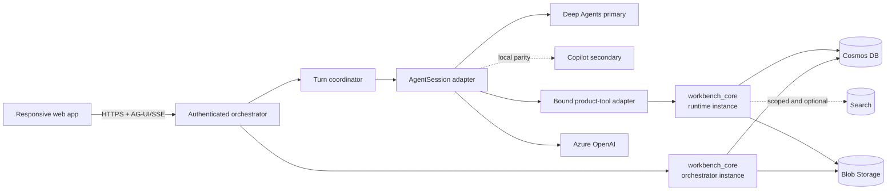

# CSA Workbench — Authoritative Product and System Design

> **Authority:** Canonical high-level product and system design  
> **State:** Target design, reconciled with integrated `master@1fcaac6`  
> **Applies to:** Product scope, system boundaries, capability ownership, and architectural direction  
> **Last reviewed:** 2026-07-14  
> **Issue:** [#18](https://github.com/DanGiannone1/csa-workbench/issues/18)

## The short version

CSA Workbench is a shared workspace for solution architects to run customer engagements. It gives each
engagement one durable home for its status, work, people, conventions, and artifacts. An embedded
assistant can navigate and operate that same workspace, but the application remains useful without
the assistant.

The key promise is simple: **a claim never outruns reality**. When the assistant says it changed a
status or created a task, the UI reloads the authoritative record that the tool actually committed.
Persuasive prose is never evidence of success.

This repository also demonstrates reusable patterns for modern agent-harness systems: trusted
per-turn context, a replaceable harness seam, structured tool outcomes, durable state outside
compute, traceable behavior, and a responsive control surface. Those patterns follow from building
a real product well; they do not turn CSA Workbench into a generic agent platform.

## The problem and the product promise

Solution architects often assemble an engagement from fragments: a status in a spreadsheet, tasks
in personal notes, files in a team channel, and important context in somebody's head. A general AI
assistant can help with a fragment, but it does not become the durable home of the engagement.

CSA Workbench makes the **Engagement** the unit of work and gives it a shared delivery record. A solution
architect should be able to open CSA Workbench on Monday morning and answer:

- Which engagements need attention, and why?
- What is the next important work?
- Who can see or change this engagement?
- Which artifacts are current and durable?
- What did the assistant use, attempt, and actually change?

The product succeeds when those answers come from live, permissioned records and remain useful even
if the agent runtime is unavailable.

## Users and priority jobs

CSA Workbench has three product roles inside an Engagement:

| Role | Primary job | Mutation boundary |
|---|---|---|
| Owner | Run the engagement and manage access | All v1 changes, including membership and identity fields |
| Editor | Contribute to delivery | Status, description, tasks, conventions, and artifacts |
| Viewer | Understand and verify the work | Read-only; no mutation affordances |

Any signed-in user may create an Engagement and becomes its first owner. Personal work remains
private to the signed-in user; Engagement work is shared only with current members.

The MVP priority journeys are:

1. **Work in a personal space.** See the Engagements that belong to the signed-in CSA.
2. **Collaborate on an Engagement.** Create, open, edit, and share an Engagement with another member.
3. **Use the assistant safely.** Read, change, and navigate product state through typed tools and
   structured outcomes rather than chat-text conventions.
4. **Trust what the product shows.** Refresh authoritative state after changes and keep failures or
   denied actions visibly distinct from success.

## Product boundary

### In the first professional release

- A personal CSA space, Engagement portfolio, and Engagement detail workspace.
- Basic Engagement creation, viewing, editing, membership, and sharing.
- Manual and agent paths that enforce the same authorization, validation, and outcome rules.
- Entra sign-in plus deterministic synthetic users for testing.
- Typed tools and structured navigation/outcomes with no chat-text control protocol.
- Responsive professional web behavior backed by tests, evals, and Playwright screenshots.
- A reproducible, low-cost deployment in a newly named CSA Workbench resource group.

### Deliberately not in the first release

- Stage pipelines, milestones, risk registers, action registers, Engagement calendars, approvals,
  free-form agent memory, schedulers, or workflow engines.
- External tenants, guests, group policy, fine-grained permissions, or customer identity federation.
- Personal document libraries, drafting/promotion workflows, general M365 or firm-knowledge
  connectors, a semantic enterprise layer, or cross-Engagement retrieval by default.
- A public/shared-key MCP endpoint, IDA-specific implementation, or a generic agent platform.
- Shell, arbitrary code execution, autonomous subagents, or multi-agent workflow features.
- Search as a required dependency. Scoped semantic retrieval may be enabled only after its
  authorization and identity contracts are proven.
- Native mobile/offline applications, real-time presence, comments, notifications, analytics
  dashboards, configurable workflows, or a broad design-system rewrite.
- SLA, multi-region, disaster-recovery automation, WAF/APIM, enterprise SIEM/DLP, or other
  production-hardening programs that do not prove the core product.

## Design principles

1. **The work lives here.** Durable product state is the source of truth; chat is a control surface.
2. **Claims follow commits.** Only a structured committed result can be shown or narrated as a
   completed change.
3. **The product works without AI.** The UI and application APIs remain complete manual paths.
4. **One rule, every caller.** Manual REST operations and agent tools use the same versioned
   application-core package for authorization, validation, mutation, and outcomes.
5. **Structured at the boundary.** The model may interpret an instruction, but application control
   happens only through typed tools, validated identifiers, and structured outcomes.
6. **Context is small and legible.** Compose trusted context once per turn, expose only safe
   projections, and read changing facts through live tools.
7. **Durability is explicit.** Cosmos owns durable product records, Blob owns durable Engagement
   bytes, and compute owns only caches and scratch.
8. **Frameworks are replaceable.** Harnesses adapt to product contracts; they do not own product
   rules or durable state.
9. **Failure stays visible.** Ambiguity, denial, no-op, conflict, degraded state, and unknown commit
   state are first-class outcomes, never collapsed into generic success.
10. **Simplify at the boundary.** Build the smallest complete architecture that proves the product;
    record deferred hardening honestly instead of designing it prematurely.

## Domain and state ownership

The domain has two scopes and three kinds of bytes/state:

| Scope or state | Owner | System of record | Visibility |
|---|---|---|---|
| Personal profile and portfolio | Actor | Cosmos | That actor only |
| Engagement record | Engagement | Cosmos, one aggregate/partition | Current members, role-gated |
| Engagement artifacts | Engagement | Blob plus Engagement metadata | Current members |
| Search index | Derived from an authorized durable source | Optional Search index | Never broader than source scope |
| Runtime memory and workspace | Session runtime | None | Ephemeral cache/scratch |

An Engagement contains:

```text
Engagement
  id, name, customer, description, targetDate?
  status: Green | Yellow | Red
  statusWhy?
  members: [actorId, role]
  tasks
  conventions
  artifacts: metadata only
  activity: bounded receipts
  version / ETag
```

Yellow and Red require a non-empty `statusWhy`. Setting Green clears the blocker reason so stale
warning text cannot survive a recovery. Stable IDs are authoritative; names may be duplicated and
therefore can be ambiguous.

Conversations remain private even when associated with an Engagement. Engagement records and
artifacts become visible only through explicit membership; nothing in a personal session is shared
automatically.

## Reference architecture



`AO` and `AR` are two in-process instances of the same immutable `workbench_core` package and contract,
not a network service and not independent implementations. The boxes show runtime responsibilities;
they do not mandate another microservice.

### Web application

The Next.js UI owns presentation, user intent, direct navigation, streaming reduction, and
authoritative-state refresh. Browser routes and form values are untrusted input. The browser never
establishes identity, permission, trusted context, or success from prose.

### Authenticated orchestrator

FastAPI is the public application boundary. It authenticates Entra or demo sessions, binds every
session to an actor, exposes manual application APIs, validates UI hints, owns the SSE proxy, and
persists conversation/turn records. It does not run harness-specific logic.

### Turn coordinator and agent runtime

The coordinator creates one immutable context snapshot and one run receipt per turn, applies a
single timeout/cancellation policy, invokes the selected `AgentSession`, and normalizes terminal
behavior. The session runtime hosts the model adapter and the narrow product-tool adapter. Deep
Agents is the deployed primary harness; Copilot is a local, non-release-blocking portability check.

### Application core

One versioned `workbench_core` package owns target resolution, live authorization, validation,
confirmation, idempotency, optimistic concurrency, activity, and structured outcomes. The
orchestrator imports one instance for manual REST calls; the runtime's bound product-tool adapter
imports another instance. There is no application-service network hop between them.

Both workloads deploy the same Git revision and application contract. The two instances share
correctness through the durable store rather than process memory. Each receives trusted actor and
session context from its own adapter, reauthorizes live state, and uses its workload's scoped managed
identity for repositories. Caller-specific policy branches are prohibited; parity tests execute the
same commands through both adapters.

REST handlers and model-visible tools remain thin adapters. MCP may be used within the runtime as a
session-bound protocol adapter around the local core instance, but it is never the domain layer and
never carries model-supplied identity.

### Data and optional services

Cosmos stores actors, personal state, and Engagement aggregates. Blob stores durable Engagement
artifact bytes when that existing capability is retained. Search remains off for the MVP.
Additional conversation, private-document, or behavior-receipt patterns may be documented for
reference, but they are not release requirements unless [requirements.md](requirements.md) adds
them.

## Trust and authorization boundaries

```text
untrusted browser/model intent
        ↓
authenticated actor + owned session
        ↓
live scope and membership resolution
        ↓
role, validation, confirmation, ETag/idempotency checks
        ↓
commit + activity + structured outcome
        ↓
authoritative refetch and truthful UI
```

- Identity comes from validated credentials and an immutable session binding, never a header or tool
  argument the model can choose.
- Personal records are addressed by the authenticated actor. Engagement reads and writes recheck
  membership at operation time and during every concurrency retry.
- Non-members receive the same not-found behavior as an unknown resource. A known member without the
  required role receives a forbidden outcome.
- Viewers are strictly read-only. Editors manage delivery work; owners alone manage Engagement name
  and membership. The last owner cannot be removed or demoted.
- Entra identities use validated tenant and object IDs. Demo identities live in a separate synthetic
  realm and can access only synthetic data. Production service access uses managed identity.
- Context may narrow or rank an authorized choice; it can never grant access or substitute for a
  live fact read.

## Turn and mutation contract

A trustworthy agent turn follows one sequence:

1. Authenticate the actor and verify the owned conversation/session.
2. Validate the UI destination hint against that actor's destination catalog.
3. Compose the minimal trusted context required by the supported tools.
4. Invoke the primary harness with user text kept distinct from trusted context.
5. Bind actor/session/context outside model-visible tool arguments.
6. Execute a narrow tool through the runtime's instance of the shared application core.
7. Return a structured result such as `committed`, `noop`, `needs_confirmation`, `ambiguous`,
   `invalid`, `not_found`, `forbidden`, `conflict`, or `failed`.
8. Emit exactly one structured terminal run state.
9. Refetch authoritative application state. Follow a canonical destination only after a committed or
   resolved result and only if a newer user navigation has not superseded it.

Destructive operations are not required for the MVP. Any destructive operation added later requires
a backend-bound confirmation contract; sending prose such as “yes” through another model pass is
not approval.

## Context and navigation

The MVP context contains only:

- actor display identity;
- validated current destination and active Engagement;
- current membership role;
- minimal user preferences needed by the supported experience; and
- active Engagement conventions when the product supports them.

Mutable Engagement facts, documents, member lists, credentials, approvals, memories, and connector
signals are not prompt context. Tools read live facts. Style precedence is `turn instruction >
Engagement convention > persona > app default`.

Known UI navigation is immediate. In chat, the model requests navigation through a typed tool whose
destination and entity identifiers are checked against the actor's authorized catalog. Neither the
frontend nor backend infers a route by scanning user text, assistant prose, marker strings, or raw
stream output. Manual search may rank a typed search-box query, but it is not a chat control channel.

## UI/UX contract

CSA Workbench should feel like a calm professional workspace, not a chat demo.

- Engagements are the default landing and first navigation item.
- Wide screens use stable navigation, a fluid workspace, and a 360–420 px assistant dock.
- Compact screens use collapsible navigation and an assistant sheet.
- Narrow web screens down to 390 CSS px use one surface at a time, with drawer navigation and
  Chat/Artifact switching. Native mobile and offline behavior remain out of scope.
- The dock and full workbench preserve the same conversation, pending confirmations, selected
  artifact, input, and scroll state.
- Tool progress uses plain outcome language. Unknown or missing results remain neutral; errors and
  denied actions stay visible.
- Target accessibility is WCAG 2.2 AA, including keyboard operation, dialog focus, non-color status,
  live announcements, 200% zoom/reflow, and reduced motion.

## Deployment profile

The reference Azure profile keeps professional boundaries without turning the showcase into a
production-hardening program:

- one region and one Azure Container Apps consumption environment;
- frontend, orchestrator, and internal session runtime using the smallest supported scale-to-zero
  profile that preserves correct behavior;
- at most one orchestrator and one session-runtime replica until durable ownership and concurrency
  no longer depend on process memory;
- Cosmos serverless and Blob LRS with managed identity and shared-key application paths disabled;
- managed identity for Cosmos, Blob, Azure OpenAI, image pull, and workload-to-workload access;
- Azure OpenAI over identity-authenticated TLS in the baseline; a private endpoint is an optional
  hardened profile rather than a v1 product gate;
- Search, Dynamic Sessions warm pools, ACA Sandboxes preview, external MCP, schedulers, Front Door,
  APIM, VPN, and NAT Gateway excluded from the baseline;
- bounded platform telemetry; and
- immutable revision identification plus a repeatable deployment command.

Scale-to-zero cold starts are an accepted tradeoff. Conversations and uploads must rehydrate from
Cosmos and Blob before scale-in can be called safe. Preview sandboxes may be investigated later for
faster resume or stronger isolation, but they are not a state store or v1 dependency.

## Evidence and quality bar

Verification reconciles what the real UI shows, what authoritative state stores, and what structured
tool/event results report. A model-written sentence is not an oracle.

The lean evidence stack is:

1. deterministic domain and contract tests for validation, roles, outcomes, and event framing;
2. adapter/integration tests showing manual REST and both harness tool paths use the same rules;
3. Playwright journeys through the real responsive frontend with repeatable synthetic data;
4. a small deterministic agent-evaluation dataset for grounding, honesty, ambiguity, and recovery;
5. a deployed Deep Agents smoke/profile for identity, collaboration, structured agent behavior, and
   scale-to-zero—run when deployment behavior changes, not as ceremony for every docs edit.

Copilot must satisfy the core behavioral contract locally, but it does not block a release. Exact
assistant wording, token timing, and raw SDK event equality are not parity criteria.

## Capability ownership

This document owns the high-level boundaries. Detailed contracts live in exactly one capability
document:

| Capability | Detailed authority |
|---|---|
| Information architecture, interaction, responsive behavior, accessibility | [UI/UX](capabilities/ui-ux.md) |
| Per-turn personalization, projections, precedence, inspector | [Context](capabilities/context.md) |
| Destination catalog, resolution, route effects | [Navigation](capabilities/navigation.md) |
| Commands, validation, confirmation, outcomes, idempotency, concurrency | [CRUD](capabilities/crud.md) |
| Uploads, drafts, artifacts, retrieval, citations | [Documents and retrieval](capabilities/documents-retrieval.md) |
| Conversation durability, rehydration, compute boundary | [Session and state](capabilities/session-state.md) |
| Harness seam, tools, prompts/skills, AG-UI, cancellation | [Agent harness](capabilities/agent-harness.md) |
| Actors, sign-in, authorization policy and role matrix, privacy, service identity | [Identity and access](capabilities/identity-access.md) |
| Azure/local topology, cost boundary, observability, degraded services | [Infrastructure](capabilities/infrastructure.md) |
| Behavioral evidence, test layers, eval datasets, release profiles | [Testing and evals](capabilities/testing-evals.md) |

[Requirements](requirements.md) define the release bar without overriding design. Runbooks describe
how the repository currently operates; they do not redefine the target architecture. Historical
decisions and Git history explain why choices changed but are not competing authorities.

## Current integrated state versus target

`master@1fcaac6` contains meaningful foundations: multi-user Engagement aggregates, role checks,
artifact storage, two harnesses, deterministic navigation, a context bundle, an assistant
dock/workbench, and scale-to-zero deployment work. Static inspection also found material gaps:

- product and architecture documentation still describe older Personal Assistant and Projects eras;
- browser code constructs context text and the inspector reconstructs it instead of consuming a
  stored turn event;
- REST and two harness files duplicate authorization, validation, mutation, and route behavior;
- structured outcomes are reduced to marker text and a small `ok/noop/error` UI vocabulary;
- conversations, chat uploads, and reference turn receipts are not durable independently of compute;
  those optional patterns must not be presented as implemented MVP behavior;
- Search is global rather than actor/Engagement filtered and must remain off;
- session ownership and tool identity still depend partly on process-local or caller-supplied state;
- responsive Engagement UX, trace retrieval, and the default Azure deployment are not currently
  proven; and
- the deployment script and legacy remote MCP path have static defects and are not a trustworthy
  baseline.

These are design inputs, not claims that the target is implemented. Runtime behavior at this
baseline remains **UNVERIFIED** unless separately captured by current behavioral evidence.

The implementation sequence should follow dependency order:

1. shared application-core package and structured outcomes;
2. actor/session binding and multi-user Engagement rules;
3. structured harness tools, events, and navigation;
4. responsive UI/UX wired to authoritative state;
5. behavioral tests, evals, and Playwright screenshots; then
6. the low-cost Azure baseline and deployed verification.

## Relationship to IDA

IDA material is a **non-authoritative reference**. CSA Workbench should be useful to the IDA team because it
demonstrates patterns in a working solution-architect product, not because CSA Workbench imports IDA's domain,
taxonomy, integration plan, or production constraints.

Useful conceptual mappings include:

| CSA Workbench pattern | Possible IDA relevance |
|---|---|
| Minimal persona and Engagement context | A small, source-aware turn-context projection |
| Live product tools | Grounding that is read at action time rather than copied into memory |
| Engagement artifacts | Permissioned shared documents with explicit lifecycle |
| Application core plus thin adapters | Reuse one rule implementation behind UI, harness tools, or a future authenticated MCP adapter |
| Structured outcomes and receipts | Evidence that claims, actions, and state agree |
| Replaceable `AgentSession` | Harness portability without moving product rules into a framework |

M365 signals, firm-wide knowledge, a semantic layer, A2A orchestration, thin/heavy MCP taxonomies,
and IDA ownership models create no CSA Workbench requirement. A future IDA integration must authenticate a
delegated actor and enter through the same application contracts; it receives no shared-key,
global-owner, or bypass path.
