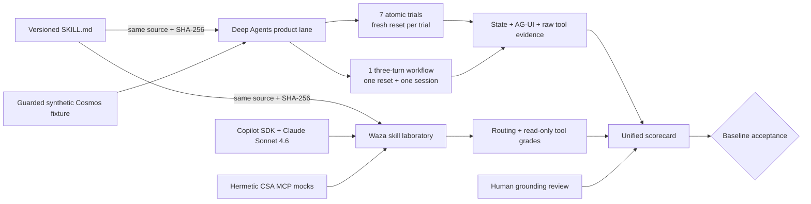
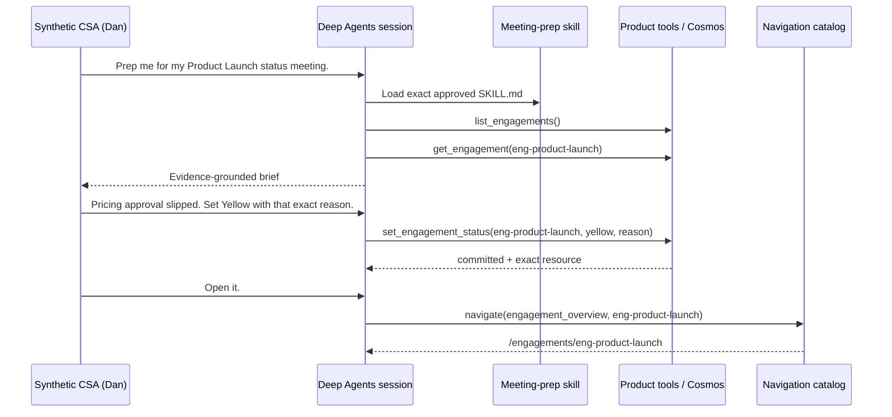

# Evals MVP reference architecture

> **Authority:** Customer-facing reference architecture subordinate to the
> [authoritative design](design.md), [Testing Charter](governance/testing-charter.md), and
> [Testing and evals](capabilities/testing-evals.md). It explains the implemented MVP; it does not
> turn an unreviewed run into release evidence.
>
> **Issue:** [#22](https://github.com/DanGiannone1/csa-workbench/issues/22)
>
> **MVP status (2026-07-20):** Source and deterministic contracts implemented. The Waza routing gate
> has a final ignored local 4/4 observation. A clean Deep Agents workflow run, human grounding approval,
> and an accepted baseline for this revision remain **UNVERIFIED**.

## The customer story

The MVP proves more than isolated tool calls. A synthetic CSA asks for a meeting brief, reports a
status change, and then says “Open it.” The assistant must carry the same Engagement through all
three turns, use a read-only meeting-prep skill only when appropriate, commit exactly one authorized
change, and resolve the correct route. Product state and structured evidence grade the facts; a
person reviews whether the brief says only what the recorded data supports.

The same `engagement-meeting-prep/SKILL.md` is also evaluated in Waza. Positive and paraphrased
meeting-prep prompts must invoke it. Plain listing and direct update prompts must not. Hermetic MCP
mocks keep that laboratory run deterministic and free of customer data.

## Architecture



The lanes deliberately retain separate provenance:

| Lane | Runs | Proves | Does not prove |
|---|---|---|---|
| Deep Agents product runtime | The real loopback API/runtime, model, product tools, guarded Cosmos fixture, and AG-UI stream | Exact actor-bound state effects, complete model-visible tool evidence, workflow continuity, skill load identity, and navigation | Copilot behavior, deployed Azure/Entra, or generalized workflow reliability |
| Waza skill laboratory | Waza v0.38.3, Copilot SDK, a named model, the same skill file, and hermetic MCP mocks | Positive/negative routing and read-only tool constraints; advisory wording graders when requested | The Deep Agents runtime, real Cosmos commits, AG-UI lifecycle, or product navigation |
| Human review | The recorded meeting-prep response beside the exact tool outputs | Whether the brief is useful and makes no unsupported claims | Product state or tool execution without the structured evidence above |

Waza and product-runtime results are complementary, not equivalent. A green Waza run cannot make a
failed product workflow pass, and a green product workflow cannot prove skill routing in Copilot.
The launcher pins the official
[Waza v0.38.3 release](https://github.com/microsoft/waza/releases/tag/azd-ext-microsoft-azd-waza_0.38.3)
and per-platform SHA-256 values. Suite and grader fields follow the official
[schema reference](https://microsoft.github.io/waza/reference/schema/) and
[grader guide](https://microsoft.github.io/waza/guides/graders/).

## Workflow under evaluation



[`tests/evals/mvp-workflows.json`](../tests/evals/mvp-workflows.json) versions that contract. Its
hard checks require one fixture reset, one session across all turns, the exact skill name and hash,
complete list/get outputs visible to the model, only the requested status delta, and navigation to
the same stable Engagement ID. The brief itself is recorded for a human grounding review; source
code does not use keywords to grade prose.

## Skill boundary

Deep Agents uses its native progressive-disclosure skill mechanism. The model receives the compact
skill catalog and may call its internal `read_file` loader. A virtual filesystem exposes exactly
`/engagement-meeting-prep/SKILL.md`; ordered permissions allow that full read and deny everything
else. Planning, shell, subagents, and generic filesystem writes remain disabled.

The loader is internal harness machinery, not an eighth product tool. It never enters the public
AG-UI tool stream. A successful load is recorded in diagnostic eval evidence with the skill name,
SHA-256, and model-visible body. Public behavior stays on the seven typed product tools documented
in [Agent harness](capabilities/agent-harness.md).

## Evidence and acceptance

Each live product run writes an ignored, run-scoped bundle beneath
`evidence/mvp/local-synthetic/agent-evals/<run-id>/`:

- `results.json`: fixture identity, revision, harness/model, atomic trials, workflow turns, state
  before/after, AG-UI events, raw tool outputs, and assistant responses;
- `scorecard.json`: compact machine-readable lane totals and acceptance state; and
- `scorecard.md`: the demo-readable summary.

Waza writes its own ignored result and transcript bundle beneath
`evidence/mvp/local-synthetic/waza/`. The merger reads both result formats and emits one scorecard
without embedding the full transcripts. The pinned launcher verifies that the skill does not change
during the run, then adds the runner version, source state, tag, skill path, and skill SHA-256 to the
generated Waza JSON. Acceptance requires that hash to match the product-run hash, Copilot SDK as the
engine, schema 1.2, and all four exact gate task IDs.

A candidate is only `READY_FOR_BASELINE` after:

1. every atomic and workflow hard check passes in the Deep Agents product lane;
2. the Waza gate is recorded with no failed, errored, or skipped task;
3. the named workflow grounding review is approved by a person against the captured tool outputs;
4. the reviewer confirms revision, fixture version and SHA-256, model, harness, and skill SHA; and
5. a person explicitly accepts that candidate as the baseline.

The generator never self-accepts a baseline. Current local Waza evidence is useful demonstration
evidence, but it remains ignored and revision-scoped. The new product workflow has not been run from
a clean source revision yet.

## Demo runbook

Start with the no-model checks:

```bash
npm run test:mvp-evidence
npm run eval:waza:check
```

Then run the routing/read-only Waza gate. This makes external Copilot/model calls and may consume
premium requests, so it is on-demand rather than part of the ordinary unit suite:

```bash
npm run eval:waza:gate
```

For the real workflow, start the local Cosmos emulator and the three application services as
described in [Local development](development.md). From a clean worktree with only synthetic local
configuration:

```bash
export IDENTITY_MODE=demo
export DEMO_PASSWORD='local-test-secret'
export COSMOS_ENDPOINT='http://localhost:8081'
export COSMOS_DATABASE='csa_workbench_demo'
export COSMOS_CONTAINER='appstate_demo'
export COSMOS_KEY='your-emulator-key'
export ARTIFACTS_DIR='.mvp-artifacts'

MVP_RESET_BEFORE_RUN=1 npm run eval:mvp
```

After reviewing the grounding transcript, copy
[`tests/evals/mvp-grounding-review.template.json`](../tests/evals/mvp-grounding-review.template.json)
into the product run directory and fill in the exact run ID, full revision, fixture version and
SHA-256, skill SHA, reviewer, timestamp, verdict, and note. Then merge the product, Waza, and human
records for presentation:

```bash
npm run eval:mvp:scorecard -- \
  evidence/mvp/local-synthetic/agent-evals/<run-id>/results.json \
  evidence/mvp/local-synthetic/waza/<waza-run>/waza.json \
  evidence/mvp/local-synthetic/agent-evals/<run-id>/combined-scorecard \
  evidence/mvp/local-synthetic/agent-evals/<run-id>/grounding-review.json
```

The merger applies the decision only when product run, full revision, fixture version and SHA-256,
and skill SHA all match. An
approved review can make the candidate `READY_FOR_BASELINE`; baseline acceptance remains a separate,
explicit human decision. Do not copy secrets, raw prompts, or full transcripts into presentation
decks.

## Deliberate MVP limits

- One skill, one three-turn workflow, one trial per case, and one synthetic actor are in scope.
- Waza prompt graders are advisory; the four-task routing/tool gate is the inexpensive hard lane.
- No simulated-user model, pass@k/pass^k, calibrated automated judge, durable evidence upload,
  production data, remote eval target, or CI model call is claimed.
- Token and premium-request usage are reported by Waza. Product-runtime token/cost capture remains a
  later improvement.
- The workflow proves conversation continuity inside one ephemeral session, not a product workflow
  engine or durable conversation history.

## Implementation map

| Concern | Source |
|---|---|
| Atomic cases | [`tests/evals/mvp-cases.json`](../tests/evals/mvp-cases.json) |
| Three-turn workflow | [`tests/evals/mvp-workflows.json`](../tests/evals/mvp-workflows.json) |
| Human grounding record | [`tests/evals/mvp-grounding-review.template.json`](../tests/evals/mvp-grounding-review.template.json) |
| Product evidence oracle | [`scripts/mvp_evidence.mjs`](../scripts/mvp_evidence.mjs) |
| Live product runner | [`scripts/mvp_agent_eval.mjs`](../scripts/mvp_agent_eval.mjs) |
| Product skill | [`session-container/product-skills/engagement-meeting-prep/SKILL.md`](../session-container/product-skills/engagement-meeting-prep/SKILL.md) |
| Native skill boundary | [`session-container/skill_runtime.py`](../session-container/skill_runtime.py) |
| Waza suite | [`tests/evals/waza/engagement-meeting-prep/eval.yaml`](../tests/evals/waza/engagement-meeting-prep/eval.yaml) |
| Pinned Waza launcher | [`scripts/waza_eval.sh`](../scripts/waza_eval.sh) |
| Unified scorecard | [`scripts/mvp_scorecard.mjs`](../scripts/mvp_scorecard.mjs) |
