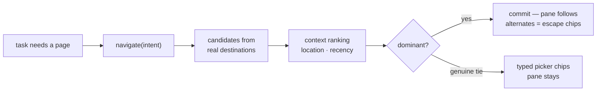

# Navigation Reference Architecture

How the assistant moves the app from one screen to another — and why navigation is a
**trust boundary**, not a place to let the model improvise.

This document is progressive: the position first, then the model, then the contract, then
the internals. Read as far down as your task requires.

---

## The position

**A route can only come from the set of destinations that actually exist. Models *select*
destinations; they never invent one.**

Everything else in this document is machinery in service of that one rule. The model
expresses *intent* in the user's words; application code owns *resolution* — deterministic,
inspectable, grounded in the live route table. However smart the selection gets (context
ranking today, vector recall or a bounded LLM tiebreak at scale), the complexity grows
**inside the tool boundary** — never inside the model loop, where every extra hop adds
latency, non-determinism, and claims that can't be falsified.

One consequence does most of the UX work: **decide, don't interrogate.** Navigation is
side-effect-free — real CRUD is decoupled from it — so a wrong page costs one corrective
click, while a clarifying question always costs a turn. When context makes one candidate
dominant, the tool commits and offers the runners-up as escape-hatch chips. Only a genuine
cold-start tie surfaces a picker — and answering it is a chip click, not a conversation.

## Two paths, one primitive

"Navigation" means changing what the app pane shows. It happens two ways, both grounded in
the same destination space:

### Path 1 — quick links (no AI, instant)

The sidebar and quick-nav links set the route directly: a click, milliseconds, no model in
the loop. A per-user **visit log** (every route change, manual or agent-driven) feeds
`rank_destinations` — recency first, salience boosts (overdue counts) on top — so the links
get better as context accrues. Context **ranks** what surfaces; it never changes what's
reachable ([personalized-navigation-via-user-context.md](personalized-navigation-via-user-context.md)).

### Path 2 — the nav tool (one tool, one call)

Users rarely ask for pure navigation — navigation happens *inside* tasks. Whenever a task
needs a page, the agent makes one call: `navigate(<the user's words, verbatim>)`. Inside
the tool boundary:

1. **Candidate retrieval** over the real destinations — registry routes × the user's
   projects × their records. Lexical today; a vector shortlist slots in when the
   destination space outgrows keywords.
2. **Context ranking** — current location, then recency, decide dominance.
3. **Decide** — commit the dominant candidate (with alternates as correction chips), or
   surface a typed picker on a genuine tie.
4. **Set the route.** The pane follows server state; a visit is logged.

### Everything composes on it

CRUD, reminders, reports — any operation that should end on a page relies on the same
primitive as its final step: record tools set the route to what they touched (create a
project task → land on the project). Navigation is the one primitive; use cases are its
consumers. It is a **baked-in tool, not a skill** — every request may need to move the app,
so it can't sit behind a trigger that might not fire.

---

## The resolver contract

All resolution lives in `resolve_destination_v2(data, destination, projects, current_route)`
([appdb.py](../session-container/appdb.py)). It is deterministic and returns exactly one of
four shapes:

| Outcome | Shape | Meaning | Effect on `currentRoute` |
|---|---|---|---|
| `resolved` | `{status, path, title}` | One clear match | **Set** to `path` |
| `resolved` + alternates | `{status, path, title, alternates[]}` | Context decided among several — runners-up ride along | **Set**; alternates render as "did you mean" chips |
| `ambiguous` | `{status, question, candidates[]}` | Genuine tie — no context separates them | **Unchanged**; candidates render as a picker |
| `not_found` | `{status, candidates[]}` | Nothing matched | **Unchanged**; closest options offered |

Three properties make this contract load-bearing:

- **Only a resolution mutates state.** The tool writes `currentRoute` on `resolved` and
  raises `AbortWrite` otherwise — an ambiguous or unknown destination leaves the app
  exactly where it was.
- **Candidates and alternates are fully bound** — `{path, title, disambiguator}`. A chip
  click is a plain manual navigation with no second resolution pass. This one mechanism
  serves three jobs: the **picker** (ambiguity), the **escape hatch** (post-decide
  correction), and the **offer** (post-CRUD "want to go there?").
- **Ambiguous and not-found are first-class outcomes, not failures to hide.** They differ
  in signal — neutral "which one?" vs an error "nothing matched" — and both give the user
  a choice instead of a wrong move or a silent fallback.

## The decide policy (dominance rules)

When several candidates survive matching, the resolver tries to decide before it asks —
in strict order:

1. **Current location wins.** Standing inside a project, "the launch tasks" means *this*
   project's — an explicit qualifier in the words beats location, but location fills
   every slot the words leave open.
2. **Strict recency wins.** The candidate the user visited more recently than *every*
   rival commits, with the rivals as escape-hatch chips. Strictly — a recency tie is not
   a decision.
3. **Otherwise, ask via chips.** A genuine cold-start tie (two "Launch" projects, no
   signal separating them) returns the typed picker. That's one click, not an
   interrogation — and the calibration is deliberate: aggressive deciding is *safe here
   only because navigation is side-effect-free*. Mutating operations keep
   confirm-style flows; the two dials are set differently because the blast radius is
   different.

The acceptance behavior this produces (proven in the resolver probe and the demo fixture):
**the same utterance — "take me to the launch tasks" — lands dan in the Launch project he
was in an hour ago (with a "did you mean" chip for the other), lands ava in hers, and asks
neither of them a question.**

## The destination space (derived, never stored)

Candidates come from three live sources, composed per call:

| Source | Destinations | Binding |
|---|---|---|
| Route registry | Personal pages (`/home`, `/todo`, `/calendar`, `/documents`, `/reminders`) | Static paths + curated keywords |
| The user's projects | Project page + settings per membership | `name` → `/projects/{id}`; **membership is the query scope**, not a filter bolted on after |
| The user's records | Tasks/events by title | title → detail route |

Nothing here is a stored copy — stored copies drift. The registry is data, the projects and
records are read live, and a destination that ceased to exist can never win (the one rule,
enforced structurally).

### Matching layers (increasingly loose, first single hit wins)

1. **Exact** — path or title equals the query.
2. **Entity titles** — a single record/project whose title equals the query.
3. **Substring + keyword** — ≥3-char substrings of titles; whole-word keyword hits
   (word-boundary rule: a 1–2 char query can't match inside a word), then two guards:

- **The stopword-residual guard.** A keyword-only match is trusted only if, after removing
  the matched keyword and filler stopwords (`my`, `the`, `page`, `view`, `show`, …), no
  content words remain. "My calendar" resolves; "crypto mining dashboard" fails loud
  instead of silently resolving to Home via the stray "dashboard" keyword.
- **The qualified-subpage guard.** A subpage matches only when the query carries its
  qualifier: "launch" must never sweep in "Website Launch **settings**". Unexplained words
  never match — the same fail-loud principle, applied to route templates.

At larger scale (hundreds of parameterized templates), layer 3 grows a **vector shortlist**
feeding the same guards, and a **bounded in-tool LLM tiebreak** (temperature 0, output
constrained to candidate ids) may replace the picker on residual ties. Both are extension
points *inside* the tool — the contract above does not change. Neither is built today;
lexical + dominance covers the current destination space, measured before replaced.

## Outcome → trace signal

Resolver outcomes surface through the custom `TOOL_CALL_RESULT` event
([architecture.md](architecture.md#sse-and-ag-ui-event-flow)):

| Tool result marker | Outcome | UI |
|---|---|---|
| `NAVIGATED to …` | `ok` | Pane follows the route |
| `NAVIGATED to … alternatives if wrong: …` | `ok` | Pane follows + "did you mean" chips |
| `AMBIGUOUS: …` | `noop` | Picker chips, pane stays |
| `NOT_FOUND: …` | `error` | Fallback chips, pane stays |

Classification comes from the tool's **leading status marker** (`_tool_outcome`,
[agent.py](../session-container/agent.py)). Neither a noop nor an error moves the user; an
unresolved navigation is never rendered as a false success.

## The frontend follow contract (event-driven, not diff-driven)

The pane follows server navigation as **behavior**, codified in
[`useAgentSession.ts`](../frontend/src/hooks/useAgentSession.ts):

1. **Follow only on a successful route-setting tool** (`ROUTE_SETTING_TOOLS`, outcome
   `ok`) — never by diffing `currentRoute`, which drops re-navigation to the same place.
2. **Manual navigation wins within the turn** — a deliberate click is not yanked back by a
   trailing refetch — unless a *later* agent navigation supersedes it that same turn.
3. **Last-issued refetch wins** — a monotonic sequence drops out-of-order `/app/state`
   snapshots so a stale read can't clobber the pane.
4. **Cancellation is respected** — after Stop, buffered events from the cancelled turn
   can't re-navigate.

The pane renders the route from `/app/state` — the store the tool mutated — never from tool
arguments or assistant prose. This is the navigation face of the
[verifiable-execution invariant](architecture.md#anatomy-of-a-turn).

## Anti-patterns

- **Don't let the model compute route paths.** It emits intent; the resolver owns paths.
- **Don't render the pane from tool arguments or assistant text.** Follow server state only.
- **Don't interrogate when context can decide** — and don't decide without an escape hatch.
  The pairing is the policy; either half alone degrades trust.
- **Don't treat ambiguous/not-found as errors to swallow or successes to fake.** They are
  outcomes with candidates — surface them.
- **Don't add bidirectional substring matching** to "be helpful." It over-matches; the
  word-boundary, stopword-residual, and qualified-subpage guards exist to fail loud instead.
- **Don't copy the destination space into storage.** Derive it live; copies drift.

## Migration: one resolver behind MCP

Each harness wires its own `navigate` tool today, but both call the same resolver. The
[planned MCP tool substrate](harnesses.md#the-reusable-substrate-direction--not-yet-built)
lifts it into one MCP server so every harness consumes one canonical navigation
implementation — identical outcomes, one place to evolve the registry, guards, and
dominance policy.

## Navigation contract checklist

For any new destination type or resolver change, verify:

- [ ] The destination space is derived live (registry × memberships × records) — no stored copies.
- [ ] Exact match is tried before fuzzy; guards (stopword-residual, qualified-subpage) hold.
- [ ] Dominance is strict: current location, then *strictly* most-recent; a tie asks.
- [ ] Every decided-among-several result carries alternates; every candidate/alternate is
      fully bound (`path`, `title`, `disambiguator`) so a chip click needs no second pass.
- [ ] Only `resolved` mutates `currentRoute`; a visit is logged on every commit.
- [ ] Markers classify correctly (`NAVIGATED`→ok, `AMBIGUOUS`→noop, `*NOT_FOUND`→error).
- [ ] The pane follows only on a successful route-setting tool; manual nav wins within the
      turn unless a later agent nav supersedes it.
