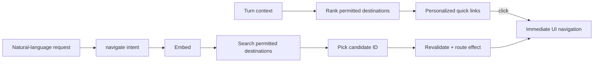

# Navigation Reference Architecture

> **Status:** target architecture. The final section maps it to the current repo and in-flight
> work; it is not a claim that every component below is shipped.

Navigation should feel like app behavior, not agent behavior. **Context personalizes the links
users see, known destinations open immediately, and only a natural-language destination requires
AI resolution.** That AI path is one grounded operation: embed the request, search real permitted
destinations, pick one candidate, revalidate it, and navigate.

## Navigation at a glance

There are two user-facing paths and one authority:

| Situation | Path | AI involved? |
|---|---|---|
| The UI already has a destination: quick link, sidebar item, record card, or successful CRUD result | Navigate immediately through the client router | No |
| The user describes a destination in natural language | Call `navigate(intent)`, which performs embed -> search -> pick -> revalidate -> navigate | Only inside the tool |



The invariant is simple:

> **A route can only come from the application's current, authorized destination catalog.**

The UI may use a route supplied by that catalog. A picker may choose an opaque destination ID
from search results. Neither the main agent nor the picker may invent a URL.

## One contract, not one expensive path

Everything uses the same **navigation contract**, but not everything uses semantic search.

- A quick link already names a grounded destination, so it opens directly.
- A successful CRUD command already knows the created or changed record, so its result carries a
  grounded route effect that the UI follows directly.
- Only an unresolved natural-language request such as "open the launch risks" needs
  `navigate(intent)`.

Calling semantic navigation for a known destination adds latency and can only make a correct answer
less reliable. Conversely, letting the model construct a route turns navigation into an
unverifiable guess. The destination catalog is the boundary between those mistakes.

## The destination catalog

The backend owns one canonical catalog of destinations. It contains static application surfaces and
dynamic destinations derived from live state, including Engagements and their records.

A destination has this logical shape:

```json
{
  "id": "destination:engagement:eng-42:risks",
  "title": "Website Launch risks",
  "route": "/engagements/eng-42/risks",
  "kind": "engagement-risks",
  "scope": {"kind": "engagement", "id": "eng-42"},
  "aliases": ["launch risks", "website risks"],
  "searchText": "Website Launch risks issues blockers",
  "version": "..."
}
```

The catalog follows five rules:

1. **Derived, not copied as truth.** Static entries come from one route registry; dynamic entries
   derive from current Engagement and record state.
2. **Permission-trimmed first.** A user can rank, search, or pick only destinations they may
   currently open.
3. **Stable identity.** Search and context refer to `destination.id`; application code maps the ID
   to the current route.
4. **Live revalidation.** The backend checks existence and authorization immediately before an
   agent-driven route effect because an index can be stale.
5. **One registry.** The sidebar, quick links, semantic search, and route generation consume the
   same definitions rather than maintaining separate route lists.

The vector index is an acceleration structure, not authority. It stores searchable catalog fields
and embeddings, but a search hit is never enough to navigate without a live catalog lookup.

## Personalized quick links

**Quick links are the highest-ranked permitted destinations for this user right now.** They are the
normal navigation experience, not an AI feature.

The deterministic ranker consumes the [turn context](context-reference-architecture.md), including:

- Current view and selected record
- Active Engagement
- Recent visits with time decay
- Visit frequency with a bounded contribution
- Due, overdue, blocked, upcoming, and recently changed salience
- Explicit pins
- Role and profile defaults for cold start

The ranker returns both a score and reason codes, for example `recent`, `active_engagement`, and
`overdue_items`. Those reasons power the context inspector and make personalization explainable.

Context **ranks but never gates**. It cannot add an unauthorized destination, and low-ranked
surfaces remain reachable through the complete navigation UI. Recency decays and frequency is
capped so yesterday's habit does not permanently bury the long tail.

### Immediate click behavior

A click does not wait for an agent, embedding, search, or context write:

1. The component receives a grounded destination from the backend.
2. The client router applies its route immediately.
3. The client asynchronously records one navigation event containing destination ID, source,
   timestamp, and Engagement scope.
4. The context service atomically updates the visit log and working Engagement from that event.

A logging failure does not roll back visible navigation. The next context bundle reports that the
behavioral signal is unavailable rather than fabricating it.

## Natural-language navigation

The agent sees one baked-in tool:

```text
navigate(intent: string) -> NavigationResult
```

The model supplies only the user's destination words. Actor identity, session, permissions, current
view, and working Engagement are bound by the runtime; they are not model-controlled tool
arguments.

### Embed -> search -> pick -> navigate

Inside the tool:

1. **Embed.** Embed the intent using the version associated with the destination index.
2. **Search.** Retrieve a small set from the actor's permission-trimmed destination index. Exact and
   lexical signals may boost vector retrieval, but every result is a real destination ID.
3. **Establish viability.** Reject candidates below a semantic relevance floor before applying
   context. Context may break close ties; it must not turn an unrelated result into a winner.
4. **Pick.** If scoring produces a clear winner, select deterministically. Otherwise call a bounded
   picker with only candidate IDs, minimal labels, the intent, and safe context reasons. Its schema
   permits exactly one supplied candidate ID and no route text.
5. **Revalidate.** Resolve the selected ID against live state and recheck authorization. If stale,
   exclude it and retry the remaining candidates once.
6. **Navigate.** Return a structured successful route effect. The frontend applies it immediately.
7. **Record.** Emit the same navigation-context event used by manual clicks.

The main agent never sees the candidate list or picker reasoning. The context inspector can show the
candidate IDs, scores, boosts, selected ID, and decision method without bloating the conversation.

**Decide, do not interrogate.** A viable grounded set should normally produce a destination. If no
candidate clears the relevance floor, return `not_found` and do not move. Do not ask a clarifying
question merely because two viable results were close; context and the bounded picker exist to make
that decision.

## Result and frontend follow contract

The backend returns data, not marker prose:

```json
{
  "status": "navigated",
  "destination": {
    "id": "destination:engagement:eng-42:risks",
    "title": "Website Launch risks",
    "route": "/engagements/eng-42/risks"
  },
  "routeEffect": {"type": "navigate", "route": "/engagements/eng-42/risks"},
  "contextId": "ctx-...",
  "decisionId": "nav-..."
}
```

Valid statuses are `navigated`, `not_found`, and `failed`. Only `navigated` carries a route effect.
The AG-UI adapter forwards that structured result without inferring success from strings or tool
names.

The frontend follows these rules:

- Follow only a successful structured route effect.
- Never route from tool arguments or assistant prose.
- A manual click after the tool starts wins over an older trailing route effect.
- A later successful agent navigation may supersede an earlier manual click in the same turn.
- Last-issued state refresh wins; stale snapshots cannot replace newer app data.
- Cancellation invalidates buffered route effects from the cancelled turn.
- Refetch authoritative app data after tool completion, but do not make the visible route wait for
  that refetch.

## CRUD composes without semantic navigation

CRUD does not navigate first. It executes from any screen using trusted context and backend scope
resolution. After a successful commit, the CRUD result includes the canonical destination of the
new or changed record. The UI follows that known route effect directly.

There is no reason to embed and search for a record the backend just returned. See
[crud-reference-architecture.md](crud-reference-architecture.md).

## Context, privacy, and auditability

Navigation both consumes and produces context:

- It consumes current view, active Engagement, visit history, salience, pins, and role defaults.
- It produces a bounded visit event and may update the working Engagement.
- Quick-link results include explanation codes.
- Semantic decisions record candidates, component scores, the selected ID, and live revalidation
  outcome.

Visit history is user data. Keep a capped log, decay old behavior, provide a clear-history control,
and do not expose raw history to the model when aggregate ranking features suffice.

## Deep Agents and MCP

`navigate` belongs in the shared backend/MCP substrate, not in each harness:

```text
LangGraph Deep Agent -> MCP adapter -> navigation service -> destination catalog/index
Copilot harness      -> MCP adapter -> navigation service -> destination catalog/index
Manual UI            -> REST/client -> known destination contract
```

For Deep Agents:

- Load the shared MCP `navigate` tool instead of defining a local `appdb` resolver.
- Bind actor, session, and tool-context projection when constructing the MCP client or request.
- Expose only `intent` to the model.
- Keep the static navigation policy in the system prompt and the per-turn context in dynamic
  middleware.
- Forward the structured result as AG-UI; do not parse status markers.

Harness parity then follows from shared execution rather than duplicated implementations.

## Current repo and migration

The current checkout ships a deterministic lexical resolver in
[`session-container/appdb.py`](../session-container/appdb.py), with separate tool wrappers in the two
agent harnesses. It has honest resolved/ambiguous/not-found behavior but no personalized quick links,
embedding index, or bounded picker.

The in-flight Projects worktree prototypes a destination registry, visit context, quick links, and
context-weighted lexical ranking. It is useful implementation evidence, but it still uses Project
terminology, has duplicate registries, lacks embed/search/pick, and does not give Deep Agents the same
navigation path. The target shared scope is **Engagement**.

The in-flight [`mcp_server.py`](../mcp_server.py) proves remote MCP transport but does not expose
navigation and is still bound to one global owner.

Migration order:

1. Rename the shared scope and route family to Engagements.
2. Establish one canonical destination registry and authorized catalog service.
3. Add atomic navigation-context recording and deterministic quick-link ranking.
4. Make known UI destinations and CRUD route effects navigate directly.
5. Add the permission-trimmed destination embedding index.
6. Implement the bounded embed/search/pick navigation service.
7. Expose that service once through MCP and use it from both harnesses.
8. Replace string markers and hardcoded route-setting tool lists with structured route effects.
9. Remove the legacy per-harness resolvers after parity checks cover both backends.

## Architecture checklist

- [ ] Quick links rank only permitted destinations and include explanation reasons.
- [ ] A known destination navigates immediately with no model or semantic search.
- [ ] The complete navigation surface remains available outside personalized links.
- [ ] Natural-language navigation is one embed -> search -> pick -> revalidate operation.
- [ ] The picker can select only an opaque ID from the supplied candidates.
- [ ] Context ranks candidates but never makes an irrelevant candidate viable.
- [ ] The backend revalidates existence and authorization before returning a route effect.
- [ ] No viable candidate leaves the UI in place with `not_found`.
- [ ] Successful CRUD uses its returned destination and never calls semantic navigation.
- [ ] Manual and agent navigation record the same bounded context event.
- [ ] AG-UI carries structured status and route effects, not parsed marker prose.
- [ ] Copilot and Deep Agents call the same backend/MCP navigation service.
