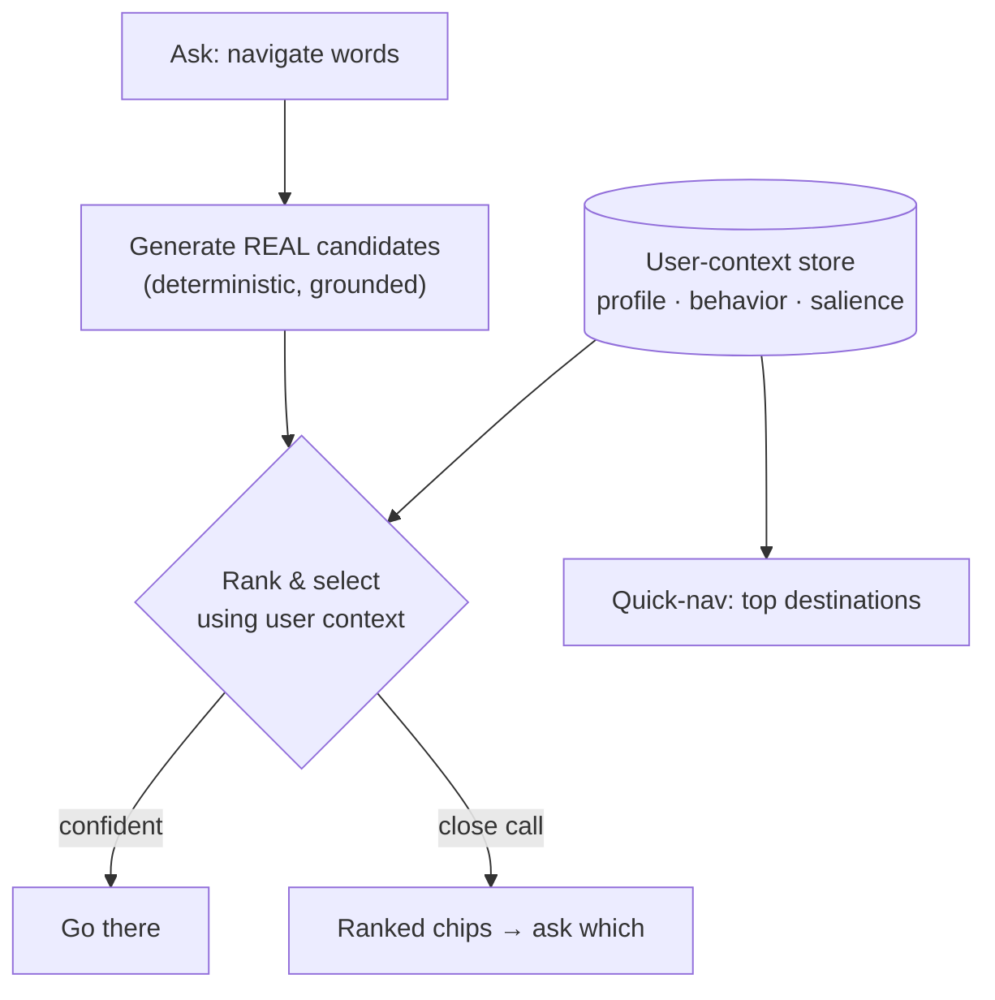

# Personalized Navigation via User Context (design direction)

> **Status: design direction — not built.** This captures the reasoning for evolving
> navigation as the app grows past a single demo user. The shipped behavior is documented in
> [navigation-reference-architecture.md](navigation-reference-architecture.md); nothing below
> changes it yet.

## The problem

Today's navigation is grounded and honest but context-blind. In the real world, users have
more destinations than fit in a static sidebar, and ambiguous asks ("open the review") usually
*do* have a most-likely answer — for that user, on that day. Two features want the same
intelligence:

- **Pre-populated quick-nav** — the sidebar/home links should surface where *this user* is
  likely to go next, not a fixed list.
- **Smarter disambiguation** — when the resolver returns several matches, rank them by what
  this user probably meant, and auto-pick only when confident.

## The principle to protect

The current design works because **the model expresses intent and deterministic code owns
resolution** — the agent cannot navigate anywhere that doesn't exist
([the trust boundary](navigation-reference-architecture.md)). Personalization must not reopen
that door. The rule:

> **User context changes the _ranking_ of destinations — never the _membership_ of what's
> reachable.**

The resolver still generates the grounded candidate set (real routes, real records, honest
`ambiguous`/`not_found`). Context only reorders and selects *within* that set.

Quick-nav and disambiguation are **the same scoring layer used twice**: quick-nav ranks *all*
of a user's destinations and surfaces the top few; disambiguation ranks the *subset* the
resolver returned. One user-context store powers both.

## What "user context" is (cheap → rich)

| Tier | Signal | Powers |
|---|---|---|
| **Session** | current view, date, conversation — already injected as `[Today: …] [Current view: …]` (`useAgentSession.ts`) | "here", "this", relative dates |
| **Salience** | what's overdue / due today / recently changed | urgency-aware ranking |
| **Behavioral** | recency + frequency of visited destinations (a lightweight nav log) | "the review" → the one opened yesterday |
| **Profile** | role, responsibilities, pinned/favorites, preferences | cold-start and role defaults |

## How the AI layers in — without losing fail-loud

1. **Deterministic ranking first.** A weighted score (recency, frequency, priority/overdue,
   profile affinity) over the grounded set. Explainable, testable, cheap; handles most cases.
2. **AI as tie-breaker only, only within the grounded set.** When deterministic scores are
   close, let the model pick among *real* options using conversation context. Safe because it
   selects — it never generates a route.
3. **Confidence threshold.** Auto-navigate only above it; otherwise show *ranked* candidate
   chips. Never silently guess when genuinely uncertain — the current honesty contract
   ([ambiguous/not-found are first-class outcomes](navigation-reference-architecture.md))
   stays intact.

## Real-world forcing functions

- **Multi-user makes this non-optional.** User context is per-user data; the single-owner
  Cosmos document ([known gap](architecture.md#limitations-and-known-gaps)) must become
  per-user keyed anyway. Personalized navigation and multi-user isolation are the same
  project — do them together.
- **Cold start.** No behavior yet → fall back to profile/role defaults, then today's static
  nav. Degrade gracefully to current behavior, never worse than it.
- **Privacy.** A nav log is user data: it needs retention limits and consent thinking, in the
  same pass as the per-user data isolation work.
- **Feedback loops.** Frequency ranking self-reinforces and buries the long tail. Personalize
  the *top*; never hide the rest; decay old signals so stale habits fade.

## Build order

1. **User-context store + deterministic ranking** — personalizes quick-nav and orders
   disambiguation chips immediately; fully testable with no model in the loop.
2. **Salience integration** — overdue/due-today boosts (the data already exists in the owner
   doc).
3. **AI tie-breaker + confidence gate** — last, smallest, and only within the grounded set.

Start at 1. The AI step is deliberately last: it depends on a clean candidate set and a
ranking baseline to beat, and the first two steps deliver most of the value on their own.
