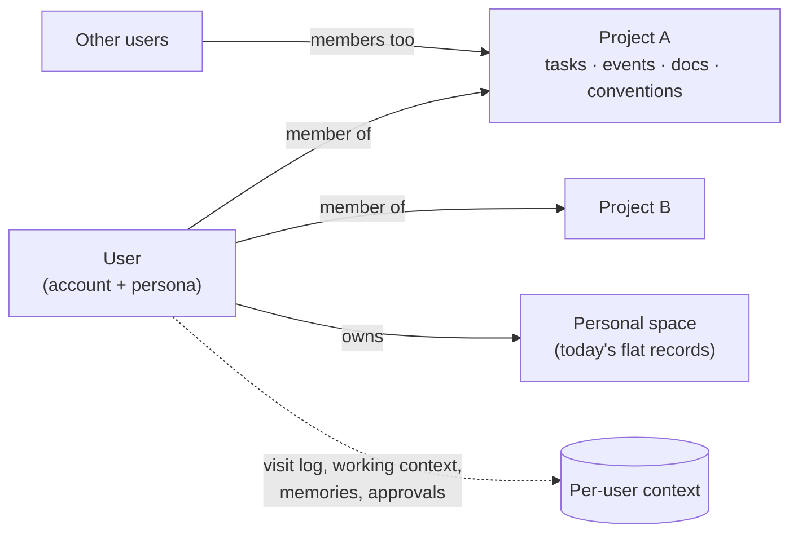

# Projects, Accounts & Context — Build Spec

**Status: aligned draft (2026-07-12) — build not started.** This specs the next increment of
the app: real user accounts, shared projects as the context scope, the navigation upgrade
those enable, preview-card CRUD, and the personal context layer
([roadmap](roadmap.md) phases 1–3 made concrete).

**The organizing rule — two callers, one app.** Every feature below is specified twice:
what the **app** does on its own (manual UI + REST, zero AI), and what the **harness**
enables on top (agent tools operating the same state). The
[verifiable-execution invariant](architecture.md#anatomy-of-a-turn) carries forward
unchanged: the pane renders only from server state; tools mutate that exact state.

**Why this build.** Today's app is single-user and flat, so the designs we've already
written — [`rank_destinations`](personalized-navigation-via-user-context.md), parameterized
navigation, context precedence — have nothing real to demonstrate against. Projects are the
**scope primitive** that makes them demonstrable: destinations gain parameters, records gain
scope, memory gains a place to attach, and sharing makes context per-user.

---

## The model at a glance

- **Users** are real accounts (username + password), seeded — no self-registration.
- **Projects** contain tasks, events, and documents, and carry **conventions** (scoped
  memory) and a **member list** with roles. No hierarchy above projects.
- **Personal space** is the existing flat workspace — every current record stays there, so
  existing demos, seed data, and the weekly-review skill keep working.
- **Per-user context** is what personalizes everything: visit log, working context, persona,
  memories, standing approvals.

---

## F1 · Accounts & sign-in

**In the app.** A sign-in screen (username + password) gating the workbench. Three seeded
users with distinct data; passwords hashed (demo-grade: no reset/lockout/MFA — the seam to a
real identity provider is the login handler, nothing else). Session = server-issued token;
every REST endpoint authenticates it. Header shows the signed-in user + sign-out.

**Via the harness.** The agent runs **as the signed-in user**: the orchestrator passes the
user id with each turn, and every tool call is scoped/authorized as that user. A `whoami`
grounding is injected into the turn preamble (alongside `[Today]` / `[Current view]`).

**State.** `users` container: `{id, username, passwordHash, displayName, persona{…}}`. App
state re-keys from the single `COSMOS_OWNER_ID` document to **one personal-space doc per
user** — the seam called out in [architecture.md](architecture.md#auth-and-trust-model)
closes here.

## F2 · Projects & membership

**In the app.** Projects list (`/projects`) + project overview page; create/rename/archive;
a settings page managing **members** (add/remove, role `owner | editor | viewer`) and
**conventions**. Viewers read, editors mutate records, owners manage members. Every project
surface is membership-gated at the REST layer — a non-member gets a 404, not a hidden button.

**Via the harness.** Tools: `list_projects`, `create_project`, `share_project`,
`resolve_project(ref)` (internal). Record tools gain an optional project argument and
resolve "the redesign project" by the same strict rules as tasks today (id → exact →
unique substring; ambiguous fails loud). Authorization is enforced **in the tool layer**,
same as REST — the model can't read or mutate a project its user isn't in.

**State.** One document per project: `{id, name, description, members[], conventions[],
tasks[], events[], library[]}` — the ETag-safe
[`appdb.update` pattern](crud-reference-architecture.md#the-mutation-primitive) applies
per-document, so concurrent edits by different members stay safe without redesign.

## F3 · Scoped records

**In the app.** Tasks/events/documents live in **either** the personal space **or** a
project. Project pages show project records; personal pages show personal records; Home
aggregates across both ("everything due this week"), always trimmed to membership. Manual
CRUD forms gain a scope picker defaulting to the current page's scope.

**Via the harness.** Scope resolution for every record tool, in order: explicit mention
("in the redesign project") → **current view** (on a project page, "add a task" means
*here*) → working context (active project) → personal space. The chosen scope is stated in
the tool result so the trace shows where the record landed.

**State.** Records move under their scope's document (personal doc or project doc). Search
and Library queries aggregate across the user's memberships — permission trimming is a
query-scope property, not a filter bolted on afterward.

## F4 · Navigation upgrade

*The [bare-bones design](navigation-reference-architecture.md#navigation-at-a-glance) made
real — this is the feature the whole build serves.*

**In the app (no AI).**
- **Parameterized routes**: `/projects/{id}`, `/projects/{id}/tasks`,
  `/projects/{id}/tasks/{tid}`, `/projects/{id}/calendar`, `/projects/{id}/documents`,
  `/projects/{id}/settings` — plus the existing personal routes. A **route registry**
  (template + title + keywords) replaces the static `routes[]` list.
- **Visit log**: every route change — manual click or agent-driven — appends
  `{path, title, ts}` to the user's log (capped ring buffer).
- **Dynamic quick links**: Home and the assistant panel render
  `rank_destinations(user_context)` top-5 — recency first (MVP), then salience boosts
  (overdue counts, upcoming deadlines). No AI in the path; links improve as context accrues.
- **Sticky working context**: "Welcome back — you were in *Website Redesign*." Sign-in
  restores the last working project; one click resumes, one click switches.

**Via the harness.** **One tool**: `navigate(intent)`. Inside the tool boundary:
1. Candidate retrieval over the user's real destinations (route registry × their projects ×
   their records) — lexical first, vector at scale.
2. Context ranking (recency, frequency, salience, current view).
3. **Decide** — deterministic when the top candidate clearly wins; a bounded in-tool LLM
   call (temperature 0, output constrained to candidate ids) only when torn.
4. Set the route. **Decide, don't interrogate** — candidates surface as chips only when
   genuinely indistinguishable, and a chip click is a plain manual nav (no agent round-trip).

**The acceptance demo** (the ten-second pitch): two users, two similarly-named projects,
same utterance — *"take me to the launch tasks"* — each user lands in **their** most-recent
launch project, instantly, no questions asked.

**State.** Per-user context doc: `{visits[], workingContext{activeProjectId, lastRoute}}`.
The destination index derives from live state — never stored copies.

## F5 · Preview-card CRUD & approvals

**In the app.** Manual CRUD keeps its current direct forms (confirm-to-delete stays). New:
an **activity feed** per project (who changed what, when) — the audit surface both callers
write to.

**Via the harness.** Mutating agent actions render a **preview card** in chat — the
proposed record with its fields, scope, and route effect — instead of prose claims:
- **Create / update**: card + auto-commit (the card *is* the visibility), unless the user
  has tightened policy.
- **Delete / bulk operations**: card + explicit **Confirm / Edit / Reject** before anything
  commits. Edit opens the card's fields inline; the corrected values go to the same tool.
- **Standing approvals**: "always allow marking tasks done" — per-user, per-action-class
  grants, listed and revocable in Settings; every auto-approval writes an audit entry.

This replaces "the agent said it did it" with "the agent showed what it will do / did" —
the same honesty contract as the [outcome classification](crud-reference-architecture.md#the-outcome-contract),
moved up to the proposal stage.

**State.** `{standingApprovals[]}` on the user context doc; `activity[]` per project doc.
Cards are structured tool results (AG-UI events), not free text — the UI renders them, the
model can't fake one.

## F6 · Persona

**In the app.** A Settings surface per user: role, tone, output preferences, language.
Stored, visible, editable — never inferred silently.

**Via the harness.** Persona is **injected** into the system preamble each turn (extending
today's `[Today] [Current view]` pattern). It shapes *how* the assistant responds — tone,
format, language — never *what* it can reach.

## F7 · Workspace memory (global + project conventions)

**In the app.** Two lists, both visible and editable: **My memory** (user-global) and
**Project conventions** (per project, e.g. "deliverables in French; round to nearest
thousand"). Members see their projects' conventions; editing follows project roles.

**Via the harness.** The agent may **propose** a memory ("Save that weekly reviews happen
Fridays?") — it is written only on user confirmation (a card, same pattern as F5). Applied
memories are scoped: global memories always load; project conventions load only when the
turn's scope touches that project.

## F8 · Precedence (the rule, stated)

When stored context conflicts, resolution order is:

**turn instruction > project convention > user persona > app default**

— specificity wins; on a tie within a level, most recently updated wins. The rule is
deterministic, documented, and the inspector (F9) shows which level fired. *(Example: persona
says "concise English"; the project convention says "deliverables in French"; the user says
"draft it in German today" → German. Tomorrow, same project, no instruction → French.)*

## F9 · Context inspector

**In the app.** A per-turn, collapsible "What I used" panel in the chat trace: persona
fields applied, memories/conventions loaded (each with *why* — its scope match), live
grounding (user, active project, current view, date), and for navigation, the candidate set
with scores. Personalization the user can audit — "why did it say that?" always has a
visible answer.

**Via the harness.** The turn preamble/bundle is emitted as a structured trace event
(sibling of `TOOL_CALL_RESULT`) — the inspector renders only what was *actually* injected,
never a reconstruction.

---

## Seed data (demo fixture)

| User | Projects (role) | Notes |
|---|---|---|
| `dan` | Website **Launch** (owner) · Product **Launch** (editor) · personal space = today's seed | Two "Launch" projects → the ambiguity fixture |
| `ava` | Product Launch (owner) · Q3 Budget (owner) | Different recency profile → different quick links |
| `sam` | Website Launch (viewer) | Read-only demos: sees, cannot mutate |

One project carries a convention ("status docs in French") for the F7/F8 demo.

## Milestones — each lands with a Playwright-verified demo

| # | Lands | Demo checkpoint |
|---|---|---|
| M1 | Accounts, sign-in, per-user personal space | Two users sign in, see separate worlds |
| M2 | Projects, membership, scoped records, project UI | Shared project: editor mutates, viewer can't; Home aggregates |
| M3 | Route registry, visit log, quick links, `navigate` upgrade | **Same utterance, different user, different landing** |
| M4 | Preview cards, confirm on destructive, standing approvals, activity feed | "Delete the done tasks" → card → confirm → audit entry |
| M5 | Persona, memory + conventions, precedence, inspector | French-convention demo + inspector explains every choice |

Each milestone lands on **both harnesses** before it counts as done (parity is the point of
the seam); testing per repo policy — real-frontend Playwright journeys, screenshots, no
mocks.

## Out of scope (deliberately)

Enterprise SSO / real IdP (the login handler is the seam) · self-registration · real-time
collaborative editing · hierarchy above projects · external connectors (M365 etc.) ·
reporting (tracked separately — see the open PR proposing it) · mobile.

## Open questions

1. **Documents storage for project scope** — project doc holds Library refs (like today) vs
   per-project workspace folders for session files. Lean: refs in the project doc, one
   shared physical store, trimmed by membership at query time.
2. **Visit-log granularity** — every route change vs meaningful dwell (>N seconds). Start:
   every change, cap the buffer, tune later.
3. **Card policy defaults** — is auto-commit-with-card right for *update*, or only create?
   Decide at M4 with the real UX in hand.
